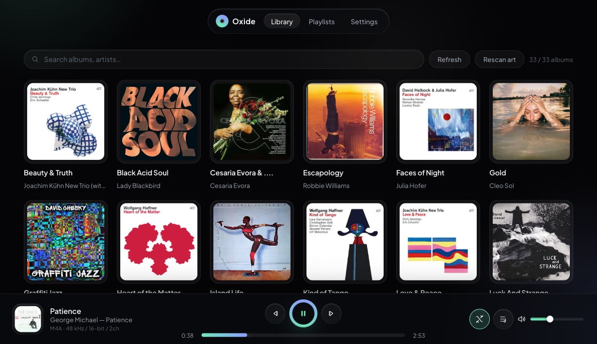
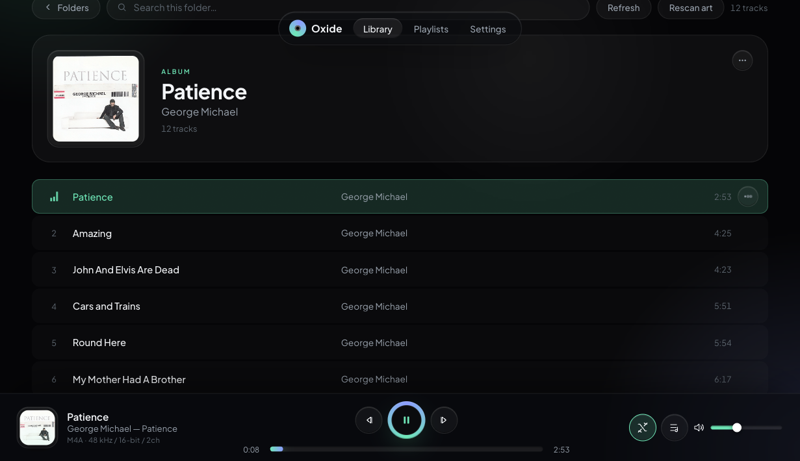
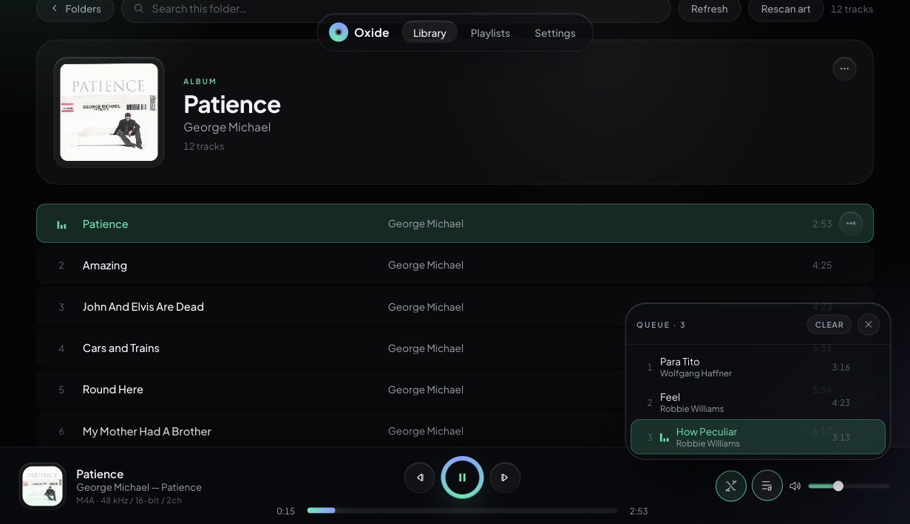
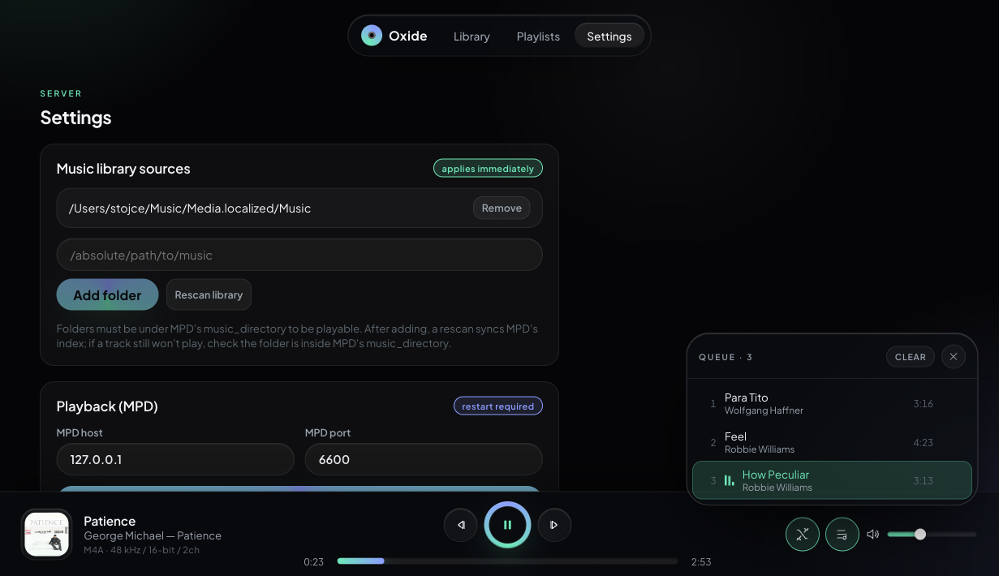
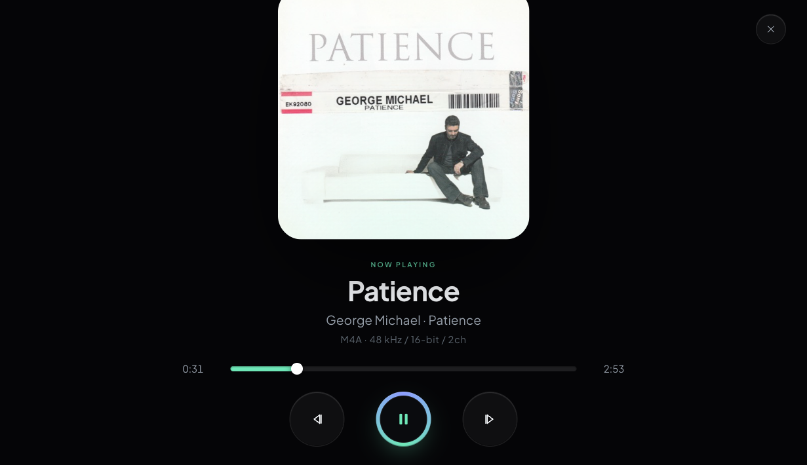
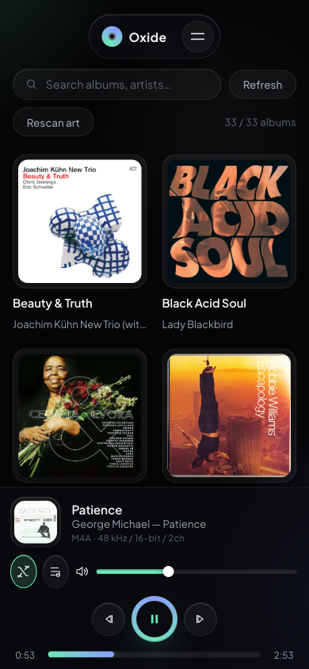

# Oxide

An audiophile music server for your local library. A Rust backend wraps
[MPD](https://www.musicpd.org/) (decode/transport) and
[CamillaDSP](https://github.com/HEnquist/camilladsp) (resampling + parametric EQ) and
serves a responsive **React** web UI, plus an optional full-screen kiosk view. One static
binary, no runtime dependencies beyond MPD and CamillaDSP, designed to sit on a headless
box feeding a USB DAC over your LAN.

Oxide is a thin control/metadata layer in front of MPD: it scans your library into a
SQLite database, serves cover art, and exposes playback, queue, shuffle, DSP and device
controls over a JSON API.

## Screenshots

| Library (desktop) | Album + now playing | Queue panel |
| --- | --- | --- |
|  |  |  |

| Settings (DSP / devices) | Kiosk mode | Library (mobile) |
| --- | --- | --- |
|  |  |  |

## Features

- **Library browser**: albums, artists, tracks with search and cover art.
- **Now-playing bar**: play/pause/stop/next/prev, scrub, volume, and live format readout
  (sample rate, bit depth, channels).
- **Queue panel**: click-to-jump, **shuffle** toggle (MPD random mode), and per-track
  remove.
- **Per-track menu**: play next, clear-and-play, add to playlist, file info.
- **DSP**: bit-perfect passthrough, resampling presets, and per-device parametric EQ.
- **Output devices**: enable/disable MPD outputs.
- **Kiosk mode**: full-screen now-playing for an attached display.
- **PWA**: installable to your home screen.

## Install

### Quick install (Debian / Ubuntu / Raspberry Pi OS)

The `curl | bash` installer provisions everything on a clean host: installs MPD + ALSA
utils, fetches/builds CamillaDSP, wires the MPD → CamillaDSP (`snd-aloop`) loopback, builds
the backend and frontend, and enables systemd units.

```bash
curl -fsSL https://raw.githubusercontent.com/OxideAI/oxide-player/main/install.sh | sudo bash
```

After install, open the web UI on your LAN (replace the IP with the server's):

```
http://<server-ip>:8000/
```

Kiosk view: `http://<server-ip>:8000/kiosk`
Config: `/etc/oxide-player/config.json`
Logs: `journalctl -u oxide-player -f`

Install knobs can be overridden via environment variables; see `install.sh` for the full
list (e.g. `MPD_MUSIC_DIR`, `LISTEN`, `BIN_DIR`, `DATA_DIR`).

### Upgrade

The installer is idempotent; re-running it updates Oxide in place while preserving your
config, library, and DSP settings.

**Quick upgrade (re-run installer):**

```bash
curl -fsSL https://raw.githubusercontent.com/OxideAI/oxide-player/main/install.sh | sudo bash
```

**From source (manual build):**

```bash
cd oxide-player
git pull
git fetch --tags
tag="$(git describe --tags $(git rev-list --tags --max-count=1))"
git checkout "$tag"
cargo build --release
sudo install -m0755 target/release/oxide-player /usr/local/bin/oxide-player
cd frontend
npm ci
npm run build
sudo systemctl restart oxide-player
```

**Prebuilt binary (skip source build):**

Fetch the latest release archive for your architecture from the
[releases page](https://github.com/OxideAI/oxide-player/releases), then:

```bash
sudo systemctl stop oxide-player
sudo install -m0755 oxide-player /usr/local/bin/oxide-player  # or $BIN_DIR
sudo systemctl restart oxide-player
```

> The frontend `dist/` is bundled inside the release archive so you only need to replace
the binary.

## Quick start (from source)

Requires Rust (stable), Node 18+, MPD, and CamillaDSP.

```bash
# 1. Backend
cargo build
./target/debug/oxide-player -c config.json        # default listen 0.0.0.0:8000
#    flags: --mpd-host <host>  --mpd-port <port>  --listen <ip:port>

# 2. Frontend (served by the backend from frontend/dist/)
cd frontend
npm install
npm run build        # tsc + vite build -> frontend/dist/
# for live UI dev: npm run dev   (Vite dev server)
```

Open the backend URL (default `http://localhost:8000/`). After changing frontend code,
rebuild with `npm run build`; the backend serves `dist/` from disk, so a UI-only change
usually needs no backend restart. New API routes do require a backend rebuild + restart.

### Config

`oxide-player` reads a JSON config (see `backend/data/config.json` for a full example).
Minimum fields:

```json
{
  "mpd_host": "127.0.0.1",
  "mpd_port": 6600,
  "listen": "127.0.0.1:8000",
  "data_dir": "backend/data",
  "library_dirs": ["/path/to/music"],
  "static_dir": "frontend/dist",
  "camilladsp_config_path": "backend/data/camilladsp/config.yml",
  "camilladsp_ws_url": "ws://127.0.0.1:1234"
}
```

## Usage

- **Library**: browse albums/tracks, search, refresh the scan or re-scan cover art.
- **Queue**: tap the **view queue** button in the player bar to open the queue; tap a track
  to jump to it, tap ✕ to remove it. The shuffle 🔀 button toggles MPD random mode.
- **Settings / DSP**: edit the CamillaDSP profile and toggle output devices.
- **Kiosk**: open `/kiosk` (or provision the optional systemd kiosk service).

## Development

- **Cargo workspace**: `cargo build` / `cargo test` work from the repo root **or** `backend/`.
  The binary lands at `target/debug/oxide-player` (repo root).
- **No Tailwind / no UI framework**: frontend uses **CSS Modules only**.
- **Bug rule**: for every bug, first write a test that reproduces it, then fix. The test
  must be added to the suite that runs before pushing to `main`.
- **MPD gotchas** (see ARCHITECTURE.md): MPD 0.24 has no `playid` (use 0-based position),
  shuffle = MPD `random` mode toggle, queue remove = `delete <pos>`, CUE albums share one URI.

## Documentation

Technical and developer documentation lives in [`ARCHITECTURE.md`](ARCHITECTURE.md):

- System architecture and request flow.
- Backend / frontend module breakdown.
- Full REST API reference.
- MPD integration notes and gotchas (0-based positions, shuffle = random mode, CUE
  handling).
- Build & serve details.

## License

See [`LICENSE`](LICENSE).