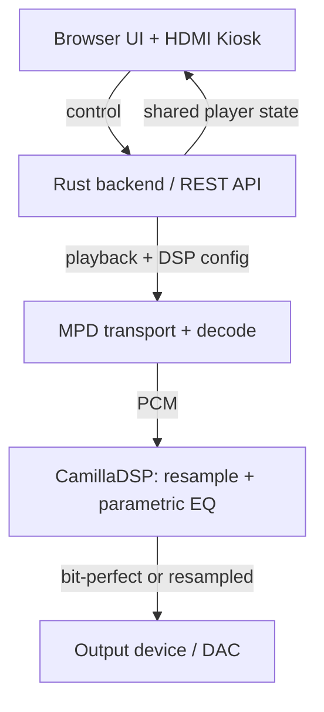

# Oxide Player v1 — Requirements

## Summary

Oxide Player is a headless, audiophile music server for Ubuntu Server, modeled on Moode Audio's local-library and lossless experience but rebuilt on a Rust backend and React frontend and installed from the CLI. v1 delivers a browsable local library, lossless playback with bit-perfect and gapless output, an audiophile DSP layer (resampling + parametric EQ), a browser control UI, and an optional HDMI kiosk display. The Rust backend wraps MPD for transport and drives CamillaDSP as the DSP insert.

## Problem Frame

Moode Audio is the reference audiophile player, but it ships as a Raspberry Pi OS image and centers a PHP/WebUI over MPD. A user on a general Ubuntu Server wants the same reliable, lossless, sound-quality-focused experience without adopting the Pi image workflow or the PHP stack. Existing Rust/React skills on the team favor a from-scratch build that keeps the proven MPD audio core while owning the library, API, UI, and DSP orchestration in Rust. The pain is the gap between "I have a headless Ubuntu server and a DAC" and "I have a reliable, Moode-like lossless player I control."

Why build rather than adopt Moode or an existing MPD web client: the team owns the Rust/React control plane end-to-end (no PHP stack, no Pi-only image), targets a LAN-trusted simplicity model, and runs the display-only kiosk as its own service so audio reliability is never coupled to the visuals. That ownership — not feature parity — is the v1 thesis.

## Key Decisions

- **K1. v1 core is library + lossless + audiophile DSP, not network renderers.** Renderers (AirPlay, Spotify/Tidal Connect, DLNA, Bluetooth) are the largest Moode surface and the riskiest to scope first; they are deferred.
- **K2. Rust wraps MPD + drives CamillaDSP.** MPD gives battle-tested lossless transport and gapless; CamillaDSP gives high-quality resampling and parametric EQ. A pure-Rust-native engine was rejected for v1 to avoid rebuilding transport stability and bit-perfect guarantees.
- **K3. Distribution is a curl|bash installer, not a .deb.** Fastest path for early testers on a clean Ubuntu Server; a packaged .deb can follow later.
- **K4. Library source is admin-pointed local directories plus OS-mounted NAS/USB.** The player watches paths; it does not manage mounts or credentials.
- **K5. UI surfaces are browser plus an optional HDMI kiosk.** The browser is primary; kiosk is opt-in and provisions a display server only when enabled.
- **K6. No authentication; LAN-trusted single admin.** Matches Moode's LAN-default and a home server threat model; auth is a later phase.
- **K7. Default output mode is bit-perfect.** At first boot, source sample rate and bit depth pass to the DAC unchanged; resampling is opt-in (R10).
- **K8. Parametric EQ is persisted per output-device profile.** Each output device keeps its own EQ tuning rather than one global configuration.

## Actors

- A1. Admin/audiophile — installs the server, points it at the library, selects the output device, tunes DSP, and controls playback.
- A2. Browser client — any device on the LAN using the React web UI.
- A3. Kiosk display — an optional attached HDMI screen showing now-playing state.
- A4. System services — the oxide-player Rust backend, MPD, and CamillaDSP, each managed by systemd.

## Key Flows

- F1. Install and first boot
  - **Trigger:** Admin runs the curl|bash installer on a clean Ubuntu Server.
  - **Actors:** A1, A4
  - **Steps:** Installer fetches the Rust binary, MPD, and CamillaDSP; creates systemd units; routes MPD through CamillaDSP to the default output; starts services; opens the web UI.
  - **Covered by:** R15, R17, R18, R19

- F2. Add library and scan
  - **Trigger:** Admin configures one or more library directories.
  - **Actors:** A1, A2
  - **Steps:** Backend walks the paths (including OS-mounted NAS/USB), extracts tags and cover art, writes the library database, and exposes it in the UI.
  - **Covered by:** R3, R4, R5, R18

- F3. Play lossless with DSP
  - **Trigger:** Admin plays a track or playlist from the browser.
  - **Actors:** A1, A2, A4
  - **Steps:** Backend sends play to MPD; MPD decodes and outputs to CamillaDSP; CamillaDSP resamples and applies EQ, then outputs bit-perfect or resampled to the DAC. Browser and kiosk reflect shared state.
  - **Covered by:** R7, R8, R9, R10, R11, R12, R17, R19

- F4. Kiosk now-playing
  - **Trigger:** Kiosk mode is enabled and an HDMI display is attached.
  - **Actors:** A3, A4
  - **Steps:** Kiosk client reads shared player state and renders cover art, track metadata, and a level meter.
  - **Covered by:** R15, R16, R19

## Requirements

**Library and metadata**

- R1. The server indexes one or more admin-configured local directories into a searchable library.
- R2. The server accepts OS-mounted NAS (NFS/SMB) and USB volumes presented as local paths; it does not manage mounts or credentials.
- R3. Library scanning extracts tags (artist, album, track, year, genre, disc/track numbers) and cover art into a local database.
- R4. The library supports user-built playlists persisted on the server.

**Playback and formats**

- R5. Playback supports lossless formats FLAC, WAV, DSD over PCM (DoP), and ALAC, plus lossy MP3/AAC/Ogg for compatibility.
- R6. Output supports bit-perfect passthrough: when enabled, the source sample rate and bit depth reach the DAC unchanged.
- R7. Playback is gapless between consecutive tracks in a playlist or album.

**Audiophile DSP**

- R8. The DSP layer provides sample-rate resampling/upsampling with a selectable quality preset.
- R9. The DSP layer provides a parametric equalizer with user-configurable biquad bands (frequency, gain, Q).
- R10. Bit-perfect (R6) and resampling (R8) are mutually exclusive per output; enabling one disables the other in the UI.

**Browser UI**

- R11. The browser UI browses and searches the library, builds playlists, controls playback (play, pause, seek, volume), and selects the output device.
- R12. The browser UI exposes DSP controls: toggle bit-perfect versus resample, set resample target rate and preset, and edit EQ bands.
- R20. The browser UI and kiosk present explicit states for empty library, scan in progress, no-output-device error, and playback error.
- R21. The browser UI is responsive and usable on mobile devices (phone and tablet), not desktop-only.

**HDMI kiosk**

- R13. An optional HDMI kiosk mode shows now-playing cover art, track/album/artist metadata, and a level meter, driven by the same player state.
- R14. Kiosk mode is disabled by default; the installer provisions a display server (X11 or Wayland) only when kiosk is enabled.

**Engine and API**

- R15. The Rust backend drives MPD for transport and decode and drives CamillaDSP as the DSP insert for resampling and parametric EQ.
- R16. The Rust backend exposes a REST API for library, playback, device, and DSP control, consumed by the React UI and the kiosk.
- R17. The backend keeps a single source of truth for player state shared by browser and kiosk clients.

**Install and runtime**

- R18. Installation uses a curl|bash installer script that installs the Rust binary, MPD, and CamillaDSP, creates systemd units, and starts the services. The installer downloads artifacts over HTTPS and verifies each one's checksum or signature before executing it.
- R19. The installer configures MPD to route audio through CamillaDSP to the selected output device.

## Acceptance Examples

- AE1. **Covers R6, R10.** Given bit-perfect is enabled, when a 24-bit/96 kHz FLAC plays, the output device receives 24/96 unchanged and resampling is off.
- AE2. **Covers R8, R10.** Given resampling is enabled at 48 kHz, when a 24/96 FLAC plays, CamillaDSP downsamples to 24/48 before the DAC.
- AE3. **Covers R10, R12.** Given resampling is active, when the user enables bit-perfect, the UI disables resampling controls and persists the change.
- AE4. **Covers R2, R3.** Given a NAS share mounted at `/music` by the admin, when a scan runs, its tracks appear in the library without the player holding mount credentials.

## Success Criteria

- Lossless formats decode and play with no quality loss versus the source file.
- Bit-perfect output is verified by the reported output format matching the source format.
- Gapless playback produces no audible gap between consecutive album tracks.
- A clean Ubuntu Server 22.04/24.04 install completes unattended via the curl|bash script and leaves the services running.
- The kiosk renders now-playing at the display's native resolution when enabled.

## Scope Boundaries

**Deferred for later**

- Network renderers: AirPlay, Spotify Connect, Tidal Connect, UPnP/DLNA, Bluetooth.
- Internet radio and podcasts.
- Multi-zone / multi-room playback.
- Authentication and multi-user libraries or EQ profiles.
- In-app NAS/USB mount management.

**Outside this product's identity**

- Not a Raspberry Pi-only OS image (the Moode distribution model).
- Not a streaming-service client (no Spotify/Tidal/Qobuz catalog integration).
- Not a mobile or desktop-native app; control is browser-based.

## Dependencies and Assumptions

- MPD is available from Ubuntu's repositories; CamillaDSP is not in the default repos and must be built from source (cargo) or fetched as a release binary — the installer strategy must provision it.
- Target is Ubuntu Server 22.04 LTS or newer on x86_64 or arm64.
- An ALSA-capable audio backend is present so MPD and CamillaDSP can reach the DAC. Modern Ubuntu Server defaults to PipeWire, so the installer must ensure `pipewire-alsa` or `alsa-utils` / pure ALSA is installed.
- The admin mounts NAS and USB volumes at the OS level before pointing the library at them.
- The LAN is trusted; no auth is required for v1.

## Outstanding Questions

- **Deferred to planning:** Exact REST API schema, library database choice, kiosk display-server choice (X11 vs Wayland), the installer's dependency-bootstrap strategy, and the resampling quality preset label set offered once resampling is enabled.

## Sources and Research

- Moode Audio (https://moodeaudio.org/) — reference feature set: MPD core, local library + NAS/USB, lossless formats, audiophile DSP, REST API, LAN-default open access.
- Moode source and docs (https://github.com/moode-player/moode, https://github.com/moode-player/docs) — confirms MPD + CamillaDSP architecture and PHP/WebUI-over-MPD model that this product reimplements in Rust/React.
- Moode "Now Playing" supplement write-up — confirms the value of a separate, display-only visual layer that does not compromise audio reliability, informing the kiosk decision (R13, R14).

