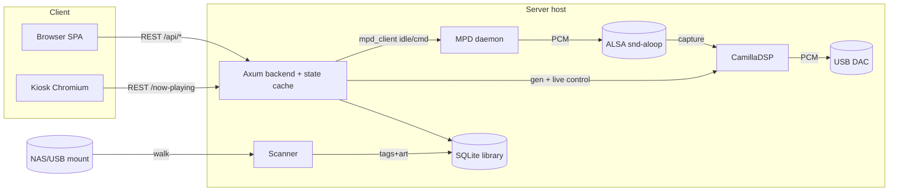

# oxide-player v1: Audiophile Music Server

## Summary
Build a headless, Moode Audio-like music server for Ubuntu Server: a Rust backend that wraps MPD for transport/decode and drives CamillaDSP for resampling and parametric EQ, exposed through a responsive React browser UI plus an optional HDMI kiosk, installed with a curl|bash script. v1 scope is local-library + lossless playback + audiophile DSP; network renderers are deferred.

## Problem Frame
Stojce wants a self-hosted, bit-perfect-capable player for a headless Ubuntu box feeding a USB DAC, with library browsing and per-device EQ, without the bloat or closed bits of off-the-shelf distros. The backend is Rust for a single static binary; the audio path reuses MPD (rock-solid decode/gapless) and CamillaDSP (reference resampler + biquad EQ) rather than reinventing the engine.

## Requirements

### Library & metadata
R1. Backend scans admin-configured local directories (including OS-mounted NAS/USB) for audio files. *(brainstorm R1)*
R2. Library supports lossless formats FLAC, WAV, DSD (DSD64/128), ALAC. *(brainstorm R2)*
R3. Library also catalogs MP3, AAC, Ogg Vorbis for completeness. *(brainstorm R3)*
R4. Backend extracts tags and cover art into a local metadata store. *(brainstorm R4)*
R5. UI shows distinct empty, scanning, and no-audio-device states. *(brainstorm R20)*

### Playback
R6. Default output path is bit-perfect: no resampling or EQ applied. *(brainstorm R6)*
R7. Gapless playback for contiguous tracks. *(brainstorm R7)*
R8. Resampling mode re-samples to a target rate with a selectable quality preset. *(brainstorm R8)*
R9. Parametric EQ applies biquad (peaking/low-shelf/high-shelf) bands per output device. *(brainstorm R9)*
R10. Bit-perfect and resampling/EQ are mutually exclusive per output device. *(brainstorm R10)*
R11. Browser UI browses and plays the library. *(brainstorm R11)*
R12. Browser UI provides transport, volume, and playlist controls. *(brainstorm R12)*
R13. Optional kiosk mode shows now-playing on an attached display. *(brainstorm R13)*
R14. Kiosk view renders cover art, metadata, and a level meter. *(brainstorm R14)*
R15. Audio path is MPD (decode/transport) feeding CamillaDSP (DSP). *(brainstorm R15)*
R16. Backend exposes a documented REST API for all player functions. *(brainstorm R16)*
R17. REST API is the single source of truth for shared player state. *(brainstorm R17)*
R18. curl|bash installer provisions the server on a clean Ubuntu Server. *(brainstorm R18)*
R19. Installer wires MPD output through CamillaDSP to the DAC. *(brainstorm R19)*

### Platform
R20. Installer verifies every fetched artifact over HTTPS against a checksum/signature. *(review-added to brainstorm R18)*
R21. Installer prerequisites an ALSA or PipeWire audio backend before provisioning CamillaDSP. *(review-added to brainstorm R18)*
R22. CamillaDSP is provisioned by build or fetch, not assumed pre-installed. *(review-added to brainstorm R18)*
R23. UI is mobile-responsive (phone/tablet). *(brainstorm R21)*
R24. UI renders scanning and playback-error states. *(brainstorm R20)*
R25. Product differentiates on local-first, Rust single-binary simplicity over feature-bloated distros. *(review-added thesis)*

## Key Technical Decisions

KTD1. **MPD client = `mpd_client` crate (elomatreb, async/tokio).** It is the only actively maintained async Rust MPD binding with typed commands and binary album-art responses; `rust-mpd` is sync and `mpdclient` (libmpdclient FFI) has no async runtime. *(Sources 1, 2)*

KTD2. **CamillaDSP provisioned via release binary or `cargo install`, routed through an ALSA `snd-aloop` loopback.** MPD outputs to `hw:Loopback,0`; CamillaDSP captures `hw:Loopback,1` and plays to the DAC. CamillaDSP is absent from Ubuntu repos, so the installer fetches or builds it. *(Sources 3, 4)*

KTD3. **Library metadata store = SQLite via `rusqlite`.** Single-file, no separate server, adequate for a local library; survives the same host as the binary.

KTD4. **Web stack = Axum 0.8 + `tower-http` `ServeDir` with `.fallback("index.html")`; built SPA embedded via `vite-rs`.** One binary serves both API and static UI; the fallback gives client-side routing. *(Sources 5, 6)*

KTD5. **Frontend = Vite + React with CSS Modules / plain CSS. No Tailwind.** Repo convention forbids Tailwind; CSS Modules keep component styles scoped without a utility framework.

KTD6. **Kiosk = systemd service launching Chromium `--kiosk --app=http://localhost:PORT/now-playing`**, provisioned only when kiosk is enabled. Avoids a native display dependency; reuses the now-playing view.

KTD7. **Installer = POSIX `curl|bash` script with arch detection (x86_64/aarch64), HTTPS fetch + SHA-256/signature check, apt install of `mpd` + ALSA/PipeWire utils, and systemd unit enablement.** Mirrors the brainstorm's chosen distribution model over a `.deb`.

KTD8. **Resampling presets = Balanced / High / Extreme**, mapping to CamillaDSP SoX-R `q` (e.g. 3 / 5 / 7) at the user's chosen target rate. Keeps the UI declarative instead of exposing raw engine knobs.

KTD9. **Per-device DSP profile persisted as JSON** (target rate, preset, EQ bands keyed by output device name). Backend renders CamillaDSP YAML from this profile and pushes live changes over CamillaDSP's websocket/HTTP control API.

## Implementation Units

U1. **Repo scaffold & build.** Cargo workspace with a `backend` crate and a `frontend` (Vite/React) package; `vite-rs` asset embedding; GitHub release workflow producing a static `oxide-player` binary per arch. Output: `Cargo.toml`, `backend/`, `frontend/`.

U2. **MPD integration module.** `mpd_client` wrapper: connect to MPD (TCP `host:port`), subscribe to `idle` for status, expose play/pause/stop/next/prev/seek/volume, current playlist read, library listing via `listall`/`search`, and output-device enumeration. Covers R15, R11, R12.

U3. **Library scanner & metadata DB.** Walk configured dirs (incl. NAS/USB mounts), extract tags + cover art (`lofty`), persist to SQLite; expose scan start/status and populate empty/scanning states. Covers R1–R5, R24.

U4. **CamillaDSP integration.** Generate/write per-device YAML config (capture `hw:Loopback,1`, playback DAC, resampler, biquad filters from the profile); control live updates via CamillaDSP websocket/HTTP; install `asound.conf` loopback + `snd-aloop` load + systemd units. Covers R8–R10, R15, R19, R21, R22, KTD2/KTD9.

U5. **REST API + shared state.** Axum router: `/api/library`, `/api/playlists`, `/api/playback`, `/api/devices`, `/api/dsp`, `/api/status`. Single in-memory player-state cache fed by the MPD `idle` loop; all UI reads/writes go through it. Covers R16, R17.

U6. **React SPA.** Browse/search library, playlists, transport/volume controls, device selector, DSP controls (bit-perfect toggle, resample target+preset, EQ band editor), mobile-responsive layout (R23), and empty/scanning/no-device/error states (R5, R24). CSS Modules only. Covers R11, R12, R23, R24, KTD5.

U7. **Kiosk mode.** Dedicated `/now-playing` view (art, metadata, Web Audio level meter) reused by a provisioned systemd kiosk service (KTD6). Covers R13, R14.

U8. **Installer (curl|bash).** Bootstrap script: detect arch, fetch+verify binary over HTTPS with checksum/signature (R20), `apt install mpd` + ALSA/PipeWire utils (R21), install CamillaDSP (R22), write `asound.conf` loopback + backend/CamillaDSP systemd units, open the LAN port, and start services. Covers R18, R19, R20–R22.

U9. **Gapless & bit-perfect verification.** Configure MPD for gapless decode; verify bit-perfect passthrough (no DSP) bit-matches source output, and that resample/EQ mutually exclude (R10). Covers R6, R7, R10.

## High-Level Technical Design

## Scope Boundaries
In scope: local library, lossless + common compressed formats, bit-perfect/gapless, resampling + per-device parametric EQ, browser UI, optional kiosk, curl|bash install. Out of scope (deferred): AirPlay/Spotify Connect/DLNA/Bluetooth renderers, TIDAL/Qobuz streaming, multi-room sync, user accounts/remote auth, automatic NAS/USB mount management.

## Risks & Dependencies
- CamillaDSP is not packaged for Ubuntu; installer must fetch/build it and keep the version pinned (R22).
- `snd-aloop` requires the ALSA loopback kernel module; some images omit it (R21). Verify load at install.
- MPD→CamillaDSP routing depends on correct `asound.conf`; a misconfigured device name breaks the path silently — surface "no audio device" in UI (R5).
- `mpd_client` tracks MPD 0.23 protocol; pin MPD version in the installer.
- Bit-perfect claim is only valid when no resampling/EQ is active; enforce mutual exclusion (R10) in the API, not just the UI.

## Acceptance Examples
AE1. With a device in bit-perfect mode and a FLAC source, the DAC reports the source sample rate and the backend applies no DSP (R6, R10).
AE2. Switching the same device to resample+EQ changes the reported rate to the target and activates bands; bit-perfect is then disabled (R8–R10).
AE3. On a clean Ubuntu Server, `curl -fsSL <url> | bash` installs, starts `mpd` + `oxide-player`, and playback works over the LAN with no manual config (R18, R19).
AE4. A play action from the browser and from the kiosk act on the same shared state; pausing in one reflects in the other (R17).

## Sources / Research
1. `mpd_client` (elomatreb) — async tokio MPD client, typed commands, binary responses: https://github.com/elomatreb/mpd_client
2. `rust-mpd` (kstep) — sync alternative; `mpdclient` (fregrem) — libmpdclient FFI, no async runtime.
3. CamillaDSP v4.1 — YAML config, ALSA/PipeWire backends, biquad filters, websocket/HTTP control: https://github.com/HEnquist/camilladsp
4. `camilladsp-config` — MPD→CamillaDSP loopback routing via `snd-aloop` + `asound.conf` + systemd: https://github.com/HEnquist/camilladsp-config
5. Axum 0.8 + `tower-http` `ServeDir::new(...).fallback("index.html")` for SPA routing.
6. `vite-rs` — embed Vite build output into the Rust binary.
