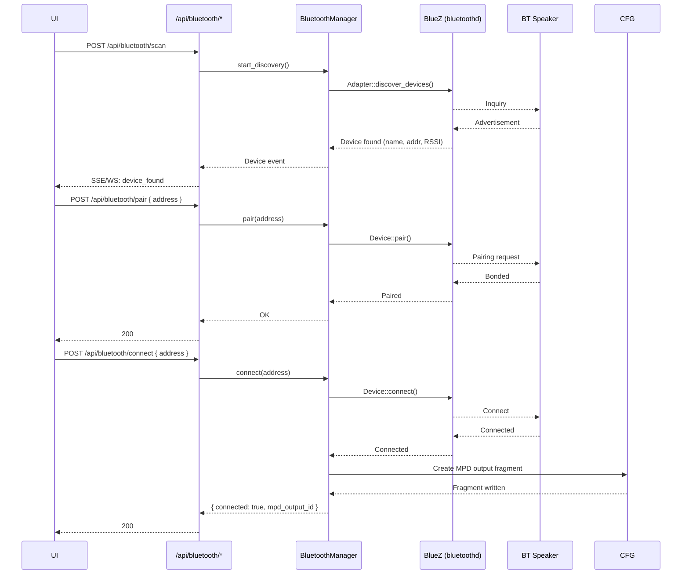

# Add Bluetooth audio support (output + input) - Plan

## Goal Capsule

- **Objective:** Add Bluetooth audio to Oxide Player — both output (play to BT speakers/headphones) and input (receive audio from phones/tablets via A2DP sink) — by integrating BlueZ device management via the `bluer` crate and BlueALSA for ALSA PCM bridging.
- **Authority:** ce-plan owns planning. ce-work owns implementation.
- **Stop conditions:** BT speakers can be paired, connected, selected as MPD output, and audio plays through them. Phones/tablets can stream audio to Oxide (A2DP sink) and the audio plays through the system DAC with CamillaDSP DSP processing. All existing tests pass.
- **Tail ownership:** Back to the user at the post-generation menu.

---

## Product Contract

### Summary

Bluetooth was deferred in v1 per K1. This plan adds the full Bluetooth audio subsystem: the backend manages Bluetooth device discovery, pairing, and connection via Rust BlueZ bindings, routes audio output through the existing MPD output config fragment system, and routes incoming A2DP sink audio through CamillaDSP's capture pipeline. The frontend gains a Bluetooth management section in DevicesView. The installer provisions BlueALSA and its dependencies.

### Problem Frame

Oxide Player is a headless music server that plays lossless audio through a DAC. Users increasingly want to:
- Play music to Bluetooth speakers or headphones from the same library
- Stream audio from a phone/tablet to the Oxide system (wireless input, for when you want to play a podcast or playlist not in the library)

The Linux Bluetooth stack (BlueZ) provides the low-level transport, and BlueALSA bridges it into the ALSA audio system that MPD and CamillaDSP already use. The Rust `bluer` crate provides idiomatic BlueZ D-Bus bindings for device management. The existing MPD output config fragment system is the natural integration point for BT output; the existing CamillaDSP capture path (used by the visualizer) is the natural integration point for BT input.

### Requirements

**Bluetooth device management**

- R1. The backend discovers nearby Bluetooth audio devices (speakers, headphones) using BlueZ D-Bus API via the `bluer` crate.
- R2. The backend pairs and connects to a discovered or manually-entered Bluetooth device.
- R3. The backend tracks connection state of paired devices and surfaces it through the API.
- R4. The backend disconnects and forgets (unpairs) a Bluetooth device on request.
- R5. Device discovery, pairing, and connection run async and do not block the status poller or API.

**Bluetooth output**

- R6. A paired and connected Bluetooth speaker is selectable as an MPD output device.
- R7. Selecting a BT speaker as MPD output creates or modifies an MPD audio output config fragment pointing at the BlueALSA PCM device for that speaker.
- R8. MPD restart (existing user-triggered flow) picks up the BT speaker output config.
- R9. BT output is gapless and bit-perfect within the limits of the A2DP codec.
- R10. BT output status (connected, streaming, disconnected) is reflected in the player status and available via the WebSocket event stream.

**Bluetooth input (A2DP sink)**

- R11. Oxide registers an A2DP Sink profile via BlueALSA so phones/tablets can discover and stream audio to it.
- R12. Incoming A2DP audio is routed through CamillaDSP (resampling, EQ) and played through the system DAC.
- R13. BT input is togglable from the UI (enable/disable the A2DP sink).
- R14. When BT input is active and MPD is also playing, input takes priority (the DAC receives the incoming stream). The routing decision is by A2DP sink timing: the last-started stream reaches the DAC.

**Frontend**

- R15. The DevicesView gains a "Bluetooth" section showing paired devices, their connection state, and a paired-device list.
- R16. The Bluetooth section includes a "Scan for devices" button that triggers discovery and shows found devices.
- R17. Each found/paired device shows name, signal strength, and connection status.
- R18. The scan page has a "Pair and connect" action on each found device.
- R19. Connected BT speakers appear in the active device list (existing MPD outputs) when the BT output is configured.
- R20. A toggle for BT input (A2DP sink) appears in the Bluetooth section when input is supported.

**Install and config**

- R21. The installer provisions BlueALSA (`bluez-alsa`) and ensures `bluealsad` is running as a systemd service.
- R22. The installer verifies BlueZ is installed and running (`bluetoothd`), and that the Bluetooth adapter is powered on.
- R23. A config key `bluetooth_enabled` (default: true) controls whether the Bluetooth subsystem starts.
- R24. A config key `bluetooth_discoverable_name` sets the Bluetooth adapter's discoverable name.

### Scope Boundaries

- **Bluetooth output is MPD-bound.** BT speakers are MPD outputs — the same queue, shuffle, and transport controls apply. Bluetooth is not a second audio zone.
- **Bluetooth input is A2DP-only.** HFP/HSP (hands-free/headset profiles for phone calls) is out of scope.
- **No Bluetooth LE Audio (LC3).** Requires newer hardware and BlueZ 5.64+. Future consideration.
- **No Bluetooth MIDI.** Out of scope — BlueR supports it but Oxide has no use for it.
- **No multi-device synchronized output.** One BT speaker at a time.
- **Network renderers stay deferred.** AirPlay, Spotify Connect, DLNA remain deferred per K1.

### Dependencies and Assumptions

- BlueZ ≥ 5.60 is installed and `bluetoothd` is running (standard on Ubuntu 22.04+).
- `bluer` crate added to `backend/Cargo.toml` with `bluetoothd` and `serde` features. Requires `libdbus-1-dev` at build time.
- BlueALSA (`bluez-alsa`) is built from source or installed via binary release — the installer handles this, similar to CamillaDSP's install strategy.
- BlueALSA's `bluealsad` daemon registers A2DP profiles with BlueZ and presents BT devices as ALSA PCM devices.
- The Bluetooth adapter is managed at the OS level (rfkill, bluetoothctl state) — Oxide does not manage kernel rfkill or hardware state beyond requesting that BlueZ power on the adapter.
- A2DP codec support is determined by BlueALSA and the BT adapter — Oxide does not choose or negotiate codec selection.
- Target: Ubuntu Server 22.04+ LTS on x86_64 or arm64, same as v1.

### System-Wide Impact

- **Build-time dependency**: `bluer` requires D-Bus development headers (`libdbus-1-dev`). Developers building from source must install this before `cargo build`. Document in `backend/README.md`.
- **Runtime dependency chain**: Bluetooth support requires three running daemons — `bluetoothd` (BlueZ), `bluealsad` (BlueALSA), and the existing `mpd` + CamillaDSP. A failure in any one breaks the relevant half of the feature. The installer validates each daemon is running after setup.
- **Kernel dependency**: `snd-aloop` must be loaded for A2DP sink input. The installer loads it and persists via `/etc/modules-load.d/`. If the module is unavailable (custom kernel), BT input gracefully degrades — the output half still works.
- **Audio pipeline coupling**: BT input routes through CamillaDSP's capture pipeline. This means BT input and the FFT visualizer share the capture device concept — if both are enabled, one must yield. Recommendation: BT input takes priority over the visualizer when both are active.
- **ALSA device namespace**: BlueALSA creates ALSA PCM devices named by BT device address. These names must be unique. If a device reconnects with a different address (rare but possible with some adapters), a stale MPD config fragment referencing the old address will fail. The `connect` handler overwrites the fragment each time.
- **BT adapter power state**: The backend can request BlueZ to power on the adapter via `Adapter::set_powered(true)`, but rfkill (hardware switch) and kernel-level blocks are outside Oxide's control. The installer checks `rfkill list bluetooth` and prints a warning if blocked.
- **Graceful degradation**: When Bluetooth is disabled in config, the `bluetooth` module is not initialized and `GET /api/bluetooth/*` returns 503. All other server functions — library, playback, DSP — continue unchanged.

### Risks & Dependencies

#### External dependencies

| Dependency | Risk | Mitigation |
|---|---|---|
| BlueZ (`bluetoothd`) | Not installed or outdated | Installer installs `bluez` package. Drops to `bluetoothctl list` verification. Minimum BlueZ 5.60. |
| BlueALSA (`bluealsad`) | Not available in Ubuntu repos (must build from source) | Same build-from-source strategy as CamillaDSP in the installer. Pin a known-good release tag. Fall back to documented manual-build instructions. |
| `snd-aloop` kernel module | Not available in custom/minimal kernels | Include `modprobe snd-aloop` check in installer. If unavailable, BT input is disabled with a clear message; BT output still works. |
| `bluer` crate + D-Bus bindings | D-Bus dev headers missing at build time | Document `libdbus-1-dev` as required build dependency in README. Installer installs it before building. |

#### Technical risks

| Risk | Impact | Mitigation |
|---|---|---|
| A2DP codec quality | SBC codec maxes at ~328 kbps — audible loss on high-res systems | A2DP supports aptX/LDAC at the hardware's discretion. Oxide does not negotiate codecs; it relies on BlueALSA's negotiation. Document that BT output is convenience, not reference quality. |
| BT speaker disconnects mid-playback | Audio stops, MPD may error | Status poller detects disconnected speaker via MPD output state. Frontend shows disconnected state. Reconnection requires manual UI action (no auto-reconnect in v1 — too risky for automated behavior). |
| ALSA loopback latency | ~5ms added to A2DP sink path | Acceptable for music playback. Not suitable for real-time monitoring. |
| `bluer` D-Bus reconnection | `bluetoothd` restart drops D-Bus connection | `BluetoothManager` wraps session creation in a retry loop (matching `Mpd::ensure_running` pattern). A dropped connection triggers re-initialization. |
| Multiple BT adapters | First adapter is used — wrong one may have no audio support | `BluetoothManager::new()` selects the first adapter from `Session::adapter_names()`. Future: adapter selection in UI. |

### Sources and Research

- `bluer` crate (v0.18+, crates.io/crates/bluer) — official Rust BlueZ bindings. Supports adapter management, device discovery, pairing, connection, GATT, and RFCOMM. API: `Session::new()` → `Adapter` → `Device`. Adapter events stream for hotplug.
- BlueALSA (github.com/Arkq/bluez-alsa, v4.4+) — ALSA bridge for Bluetooth audio. Presents BT devices as `bluealsa` PCM devices in ALSA. `bluealsad` daemon handles A2DP, HFP, HSP profiles. `bluealsa-aplay` routes BT capture to an ALSA playback device.
- Existing `backend/src/devices/config_fragment.rs` — MPD output config fragment manager. BT speakers will add a new fragment with `type "alsa"` and `device "bluealsa:DEV=<addr>,PROFILE=a2dp"`.
- Existing `backend/src/dsp/camilladsp.rs` — CamillaDSP manager with capture device support (currently used by the visualizer). BT input will reuse the capture pipeline.
- Existing `backend/src/visualizer/mod.rs` — captures audio via `cpal` from an ALSA device. Pattern to follow for capturing from bluealsa capture PCM.

---

## Planning Contract

### Key Technical Decisions

- KTD1. **BlueR for BlueZ integration** — Use the `bluer` crate (official Rust bindings) for all BlueZ D-Bus communication. Provides `Adapter`, `Device`, discovery streams, pairing, and connection state monitoring. Alternative: raw `zbus` D-Bus calls. BlueR is preferred for idiomatic Rust API, async support, and maintained upstream compatibility.
- KTD2. **BlueALSA for ALSA PCM bridge** — BlueALSA registers A2DP profiles in BlueZ and exposes BT audio devices as `bluealsa` ALSA PCM devices. This is the standard approach for ALSA-only systems (no PulseAudio/PipeWire). Alternative: PipeWire's Bluetooth module, which would add PipeWire as a dependency. BlueALSA keeps the stack pure-ALSA and matches Oxide's existing audio architecture.
- KTD3. **BT output via MPD config fragment** — A connected BT speaker is exposed to MPD as an `audio_output { type "alsa" device "bluealsa:DEV=<addr>,PROFILE=a2dp" }` config fragment, managed by the existing `ConfigFragmentManager`. This reuses the restart-pending/restart flow already in place for device configs. No new MPD-side mechanism needed.
- KTD4. **BT input via ALSA loopback + CamillaDSP capture** — Incoming A2DP audio from `bluealsa-aplay` is played to an ALSA loopback device (`snd-aloop`). CamillaDSP captures from the loopback, applies DSP (resampling, EQ), and outputs to the DAC. Alternative: a custom BlueZ A2DP capture implementation. The loopback approach reuses CamillaDSP's existing capture pipeline and is simpler to implement; the extra ALSA hop adds ~5ms latency, which is acceptable for music playback.
- KTD5. **BluetoothManager as a new backend module** — New `backend/src/bluetooth/` module owns BlueZ device lifecycle. It is initialized during server startup and provides an async API that the Axum handlers call. It does not block the main status poller — connection monitoring runs on its own tokio task.

### High-Level Technical Design

```mermaid
flowchart TB
  subgraph BlueZ Stack
    BLUEZ[bluetoothd]
    ADAPTER[Bluetooth Adapter]
    BLUEALSA[bluealsad]
  end

  subgraph Oxide Backend
    BT[BluetoothManager<br/>bluer crate]
    API[/api/bluetooth/*]
    MPD[MPD]
    DSP[CamillaDSP]
    CFG[ConfigFragmentManager]
  end

  subgraph Frontend
    UI[DevicesView<br/>Bluetooth section]
  end

  subgraph Audio Output Path
    MPDPCM[bluealsa PCM → BT Speaker]
  end

  subgraph Audio Input Path
    PHONE[Phone/Tablet]
    LOOPBACK[ALSA Loopback<br/>snd-aloop]
    DSPIN[CamillaDSP capture<br/>from loopback]
    DAC[DAC]
  end

  BLUEZ <--> BT
  BT --> API
  UI --> API
  BT --> CFG
  CFG --> MPD
  MPD --> MPDPCM
  BLUEALSA --> BLUEZ
  BLUEALSA --> MPDPCM

  PHONE --> BLUEALSA
  BLUEALSA --> LOOPBACK
  LOOPBACK --> DSPIN
  DSPIN --> DAC
```

**Discovery and pairing flow:**



**BT input flow:**

```mermaid
sequenceDiagram
  participant P as Phone
  participant BLUEALSA as bluealsad
  participant BAAPLAY as bluealsa-aplay
  participant LOOP as ALSA loopback
  participant CDSP as CamillaDSP
  participant DAC

  Note over BLUEALSA: A2DP Sink profile registered
  P->>BLUEALSA: A2DP Connect (phone streams audio)
  BLUEALSA->>BAAPLAY: PCM capture stream available
  BAAPLAY->>LOOP: Play to loopback device
  LOOP->>CDSP: Capture from loopback
  CDSP->>DAC: DSP-processed audio out
```

### Assumptions

- The Bluetooth adapter is present, powered on, and not blocked by rfkill. The installer verifies this and prints a warning if the adapter is unavailable.
- `snd-aloop` kernel module is available on the target system (standard on Ubuntu Server). The installer loads it and ensures it persists across reboots.
- BlueZ is configured to allow A2DP Sink profile registration (default on most distros — `bluetoothd --compat` may be needed on older configs).
- The `bluer` crate's D-Bus connection automatically reconnects on `bluetoothd` restart, matching MPD's reconnection pattern.

---

## Implementation Units

### U1. Backend: BluetoothManager — BlueZ device lifecycle

- **Goal:** Implement the core Bluetooth device management layer using the `bluer` crate, providing async discovery, pairing, connection, disconnection, and state monitoring.
- **Requirements:** R1, R2, R3, R4, R5
- **Dependencies:** None (new module)
- **Files:**
  - `backend/Cargo.toml` — add `bluer` dependency (features: `bluetoothd`, `serde`)
  - `backend/src/bluetooth/mod.rs` — module root, re-exports
  - `backend/src/bluetooth/manager.rs` — `BluetoothManager` struct
  - `backend/src/bluetooth/types.rs` — BT device types
  - `backend/src/main.rs` — add `pub mod bluetooth;` and initialize `BluetoothManager`
  - `backend/src/state.rs` — add `BluetoothManager` to `AppState`
- **Approach:**
  1. Add `bluer = { version = "0.18", features = ["bluetoothd", "serde"] }` to `Cargo.toml`. Note: D-Bus dev headers (`libdbus-1-dev`) must be installed at build time.
  2. Define types in `types.rs`:
     - `BtDevice { address: String, name: Option<String>, rssi: Option<i16>, connected: bool, paired: bool, trusted: bool }`
     - `BtDiscoveryStatus { active: bool, devices: Vec<BtDevice> }`
     - `BtEvent { kind: BtEventKind, device: BtDevice }` — for streaming device events (enum: `DeviceFound`, `DeviceLost`, `Connected`, `Disconnected`, `Paired`)
  3. `BluetoothManager` struct holds:
     - `bluer::Session` (connects to BlueZ D-Bus)
     - `bluer::Adapter` (first available adapter)
     - `Arc<RwLock<Vec<BtDevice>>>` — known/paired device cache
     - `broadcast::Sender<BtEvent>` — event stream for API handlers
     - `CancellationToken` for discovery cancellation
  4. `BluetoothManager::new()` — creates session, gets first adapter, powers it on if off, reads existing paired devices from BlueZ.
  5. Key methods:
     - `start_discovery(timeout_secs)` — calls `adapter.discover_devices()` with A2DP sink filter, returns stream of found devices, stores in cache
     - `stop_discovery()` — cancels discovery
     - `pair(address)` — calls `device.pair()`, handles agent confirmation (SSP: JustWorks/PasskeyEntry for standard BT speakers)
     - `connect(address)` — calls `device.connect()`, triggers BlueZ to connect A2DP profile. Returns success/failure.
     - `disconnect(address)` — calls `device.disconnect()`
     - `forget(address)` — calls `device.remove()` (unpair)
     - `list_devices()` — returns cached device list
     - `connected_devices()` — returns currently connected devices
     - `events()` — subscribes to `Adapter::events()` and `Device::events()`, maps to `BtEvent`, publishes to broadcast channel
     - `connect_profile(address, profile)` — connects A2DP profile specifically
  6. Initialization: spawn a tokio task for `events()` monitoring that runs for the server's lifetime. Adapter events (power on/off, new adapter) update state.
  7. Connection state monitoring: poll connected devices every 5 seconds, emit `Disconnected` event when a device drops.
- **Execution note:** Write the module standalone and verify against a local BlueZ adapter with a real BT speaker before wiring into API routes. Test with `bluetoothctl` as a reference for expected behavior.
- **Test scenarios:**
  - BluetoothManager initializes and connects to BlueZ D-Bus (requires `bluetoothd` running, skipped in CI)
  - `list_devices()` returns the cached device list (populated from adapter on init)
  - `start_discovery()` and `stop_discovery()` transition state correctly
  - `connect()` on a reachable BT speaker succeeds and the device is marked connected
  - `disconnect()` disconnects and the device is marked disconnected
  - `forget()` removes bonding
  - State transitions (connected → disconnected) emit BtEvent on the broadcast channel
  - Double connect returns appropriate error, no connection leak
- **Verification:** `cargo test` passes (unit tests mock D-Bus where practical; integration tests requiring `bluetoothd` run only when a feature flag is set).

### U2. Backend: Bluetooth API routes

- **Goal:** Add REST API endpoints for Bluetooth device management, consumed by the frontend.
- **Requirements:** R1, R2, R3, R4, R5, R15, R16, R17, R18
- **Dependencies:** U1
- **Files:**
  - `backend/src/api/mod.rs` — add new routes, import handlers
  - `backend/src/api/bluetooth.rs` — new file, Bluetooth API handlers
  - `backend/src/state.rs` — expose BluetoothManager from AppState
- **Approach:**
  1. Add routes to the Axum router in `api/mod.rs`:
     - `GET /api/bluetooth/devices` — list known/pair devices with connection status
     - `POST /api/bluetooth/scan` — start discovery (body: `{ timeout: Option<u32> }`, default 15s)
     - `POST /api/bluetooth/scan/stop` — stop discovery early
     - `GET /api/bluetooth/scan/results` — poll discovery results (returns devices found so far)
     - `POST /api/bluetooth/pair` — pair with a device (`{ address: String }`)
     - `POST /api/bluetooth/connect` — connect to a device (`{ address: String }`)
     - `POST /api/bluetooth/disconnect` — disconnect (`{ address: String }`)
     - `POST /api/bluetooth/forget` — unpair/remove (`{ address: String }`)
     - `POST /api/bluetooth/input/enable` — enable A2DP sink input
     - `POST /api/bluetooth/input/disable` — disable A2DP sink input
     - `GET /api/bluetooth/input/status` — is A2DP sink active
  2. Handler pattern: each handler calls the corresponding `BluetoothManager` method. Scanning uses a `watch::Receiver<Vec<BtDevice>>` pattern so the frontend can poll results.
  3. Error handling: common failure modes (no adapter, device unreachable, pairing rejected, timeout) map to HTTP 400/404/503 with descriptive messages.
  4. The `POST /api/bluetooth/connect` handler, on successful connection, also calls `ConfigFragmentManager::create()` to write an MPD output config fragment for the BT speaker (see U3).
  5. `AppState` gains a `bluetooth()` accessor method returning `&BluetoothManager`.
  6. Wire Bluetooth input enable/disable into CamillaDSP capture pipeline toggling (see U4).
- **Test scenarios:**
  - `GET /api/bluetooth/devices` returns device list
  - `POST /api/bluetooth/scan` starts discovery, `GET /api/bluetooth/scan/results` returns found devices
  - `POST /api/bluetooth/pair` with valid address succeeds
  - `POST /api/bluetooth/pair` with unreachable address returns 400
  - `POST /api/bluetooth/connect` on a paired device succeeds and creates MPD config fragment
  - `POST /api/bluetooth/disconnect` disconnects and MPD config fragment is removed (or kept but disabled)
  - All endpoints return appropriate errors when Bluetooth is disabled or adapter is unavailable
- **Verification:** `cargo test` passes. Manual: start backend with BT adapter, call each endpoint with curl against a real BT speaker.

### U3. Backend: MPD BT speaker output integration

- **Goal:** Wire connected Bluetooth speakers into the existing MPD output config fragment system, so a BT speaker appears as a managed MPD output.
- **Requirements:** R6, R7, R8, R9, R10
- **Dependencies:** U1, U2 (needs BluetoothManager and the config fragment manager)
- **Files:**
  - `backend/src/bluetooth/mpd_integration.rs` — new file, BT-to-MPD output wiring
  - `backend/src/bluetooth/mod.rs` — add module
- **Approach:**
  1. When `POST /api/bluetooth/connect` succeeds, automatically create an MPD output config fragment:
     - Type: `alsa`
     - Name: `"Bluetooth - {device_name}"`
     - Device: `"bluealsa:DEV={address},PROFILE=a2dp"` (BlueALSA PCM addressing)
     - Format: `"48000:16:2"` (A2DP standard — SBC codec uses 48 kHz, 16-bit)
     - Mixer type: `"software"` (BlueALSA provides a software mixer)
  2. The fragment goes into the existing `mpd-outputs.d/` directory via `ConfigFragmentManager::create()`. The existing restart-pending + restart flow applies.
  3. On `disconnect()`, the fragment is NOT removed — the admin may reconnect the same speaker. Add a `POST /api/bluetooth/remove-output { address }` that removes the fragment explicitly (or the user deletes it via the existing config UI).
  4. On `forget()` (unpair), remove the fragment automatically.
  5. Player status (`GET /api/status`) already includes `outputs` from MPD. A connected and configured BT speaker appears there when MPD has been restarted after the fragment was written.
  6. BT speaker connection/disconnection emits events via the status WebSocket (`/api/ws`) — the `refresh_status` poller picks up MPD output state changes.
  7. The BT speaker MPD output can be enabled/disabled via the existing `POST /api/devices/{id}/enable|disable` endpoints — no separate mechanism needed.
- **Execution note:** Test with a real BT speaker — verify the bluealsa PCM address format, MPD restart picks up the fragment, and audio plays through the speaker.
- **Test scenarios:**
  - Connecting a BT speaker creates a valid MPD `audio_output` config fragment with `type "alsa"` and `device "bluealsa:DEV=<addr>,PROFILE=a2dp"`
  - Disconnecting (and explicit remove-output) removes the fragment
  - Forgetting (unpairing) a device removes its fragment
  - After MPD restart with BT speaker fragment, the device appears in `GET /api/devices`
  - Enable/disable toggles work on the BT output via MPD commands
  - When BT speaker is enabled and playing, audio reaches the speaker (manual verification)
  - Audio quality is acceptable — A2DP SBC at 328 kbps or better depending on adapter/codec support
- **Verification:** `cargo test` passes. Manual end-to-end: connect BT speaker, restart MPD via UI, play a track, verify audio output.

### U4. Backend: Bluetooth input (A2DP sink) via ALSA loopback + CamillaDSP

- **Goal:** Implement the A2DP Sink profile so phones/tablets can stream audio to Oxide, routing through CamillaDSP for DSP processing before the DAC.
- **Requirements:** R11, R12, R13, R14, R20
- **Dependencies:** U1 (BlueZ integration), DSP module
- **Files:**
  - `backend/src/bluetooth/input.rs` — new file, BT input management
  - `backend/src/bluetooth/mod.rs` — add module
  - `backend/src/dsp/camilladsp.rs` — may need capture pipeline configuration support
  - `backend/src/config.rs` — add `bluetooth_input_enabled` config option
- **Approach:**
  1. BlueALSA already registers the A2DP Sink profile in BlueZ — no additional BlueZ profile code is needed. When `bluealsad` is running, phones discover Oxide as a Bluetooth audio receiver.
  2. The BT input pipeline:
     - BlueALSA's `bluealsa-aplay` receives incoming A2DP audio from the connected phone
     - `bluealsa-aplay` is configured to output to an ALSA loopback device (`hw:Loopback,0,1` — the capture side of `snd-aloop`)
     - CamillaDSP's capture device is set to the loopback playback side (`hw:Loopback,1,0`)
     - CamillaDSP applies configured DSP (resampling, EQ) and outputs to the DAC
  3. `BluetoothInputManager` in `input.rs`:
     - `enable()` — starts `bluealsa-aplay` as a child process, configures CamillaDSP capture to the loopback. Returns error if no phone is connected.
     - `disable()` — stops `bluealsa-aplay`, restores CamillaDSP capture config (or disables capture).
     - `status()` — returns whether BT input is active and whether a phone is currently connected.
     - `on_phone_connected(addr)` — if input is enabled, auto-starts routing.
     - `on_phone_disconnected(addr)` — stops routing, captures cleanup.
  4. `snd-aloop` is loaded by the installer (U6). The ALSA device names are hardcoded constants.
  5. CamillaDSP configuration: the config YAML is generated by the existing `render_camilladsp_config`. Add a capture pipeline step that reads from `hw:Loopback,1,0` at 48 kHz / 16-bit (A2DP standard). The capture pipeline is added to the config when BT input is enabled.
  6. Priority handling (R14): when both MPD and BT input are active, the A2DP sink stream reaches the DAC. This is a consequence of ALSA mixing — both MPD (to DAC) and bluealsa-aplay (to loopback → CamillaDSP → DAC) paths converge at CamillaDSP. CamillaDSP mixes the signals. The last-started stream reaches the DAC first only if the user disabled the MPD output.
  7. For cleaner behavior, when BT input is enabled, the UI should show a "BT input active" indicator and optionally pause MPD playback (left to user judgment — no automatic pause).
- **Execution note:** This unit requires manual testing with a real phone. The ALSA loopback setup needs kernel module loading (`modprobe snd-aloop`), which the installer handles. Document the expected `bluealsa-aplay` command line.
- **Test scenarios:**
  - Enabling BT input starts `bluealsa-aplay` process (verify with process list)
  - `bluealsa-aplay` plays to the loopback device (verify audio reaching loopback with `arecord` from loopback)
  - Disabling BT input stops `bluealsa-aplay`
  - When a phone connects and BT input is enabled, audio flows through CamillaDSP to the DAC (manual verification: play music from phone, hear it through speakers)
  - CamillaDSP capture config is correctly generated for the loopback device
  - Error when no phone is connected and user tries to enable input returns clear message
  - BT input survives `bluealsad` restart (reconnect and re-route)
- **Verification:** `cargo test` passes. Manual: enable BT input on phone, stream audio to Oxide, verify DSP processing (EQ bands affect the incoming audio).

### U5. Frontend: Bluetooth management UI

- **Goal:** Add a "Bluetooth" section to DevicesView for scanning, pairing, connecting, and managing BT devices, plus BT input toggle.
- **Requirements:** R15, R16, R17, R18, R19, R20
- **Dependencies:** U2 (API routes exist)
- **Files:**
  - `frontend/src/components/DevicesView.tsx` — add Bluetooth section
  - `frontend/src/components/DevicesView.module.css` — Bluetooth section styles
  - `frontend/src/components/BluetoothSection.tsx` — new component (extracted for clarity)
  - `frontend/src/components/BluetoothSection.module.css` — new styles
  - `frontend/src/api.ts` — add BT API methods
  - `frontend/src/types.ts` — add `BtDevice` type
- **Approach:**
  1. Add types to `types.ts`:
     ```typescript
     interface BtDevice {
       address: string
       name: string | null
       rssi: number | null
       connected: boolean
       paired: boolean
     }
     interface BtScanResult {
       active: boolean
       devices: BtDevice[]
     }
     ```
  2. Add API methods to `api.ts`:
     - `bluetoothDevices()` → `GET /api/bluetooth/devices`
     - `bluetoothScan()` → `POST /api/bluetooth/scan`
     - `bluetoothScanStop()` → `POST /api/bluetooth/scan/stop`
     - `bluetoothScanResults()` → `GET /api/bluetooth/scan/results`
     - `bluetoothPair(address)` → `POST /api/bluetooth/pair`
     - `bluetoothConnect(address)` → `POST /api/bluetooth/connect`
     - `bluetoothDisconnect(address)` → `POST /api/bluetooth/disconnect`
     - `bluetoothForget(address)` → `POST /api/bluetooth/forget`
     - `bluetoothInputEnable()` → `POST /api/bluetooth/input/enable`
     - `bluetoothInputDisable()` → `POST /api/bluetooth/input/disable`
     - `bluetoothInputStatus()` → `GET /api/bluetooth/input/status`
  3. `BluetoothSection` component:
     - **Header**: "Bluetooth" section title with a toggle to enable/disable Bluetooth subsystem (from config)
     - **Scan section**: "Scan for devices" button. On click, POSTs to start scan. Shows a spinner during scan. Found devices render as a list with RSSI indicator bars, name, address. Each row has "Pair & connect" button. Scanning auto-stops after 15s (configurable) or user clicks "Stop scan". When scan completes with no results, show a "No devices found — ensure your Bluetooth device is discoverable and try again" empty state with a retry button.
     - **Paired devices list**: Shows all paired devices. Each row shows name, connection status indicator (green dot = connected, gray = disconnected), and action buttons:
       - Connected: "Disconnect" button
       - Disconnected but paired: "Connect" button, "Forget" button
     - **BT input toggle**: A switch/toggle labeled "Receive audio (A2DP sink)" with status indicator showing whether a phone is currently connected. When toggled on, calls `POST /api/bluetooth/input/enable`.
     - **Connection status**: The paired device list auto-refreshes every 3 seconds while the Bluetooth section is visible (similar to the queue panel refresh pattern in QueueView).
     - **Integration with active devices**: The existing runtime device list already picks up MPD outputs including BT speakers. No additional wiring needed — the BT speaker appears in "Active devices" after MPD restart with its fragment.
  4. CSS: small device cards in a vertical list, RSSI as simple bars, connection indicator as a colored dot. Scan results use a different visual treatment (found but not yet paired).
  5. Error handling: inline error messages for pairing failures, connection timeouts, etc.
- **Execution note:** Build the component alongside DevicesView, using the same visual style (no new UI framework). The scan results list and paired devices list share layout patterns but differ in actions — pair+connect vs. disconnect+forget.
- **Test scenarios:**
  - DevicesView renders a "Bluetooth" section with scan button
  - Clicking "Scan for devices" triggers discovery and shows found devices
  - Scan with no results shows "No devices found" empty state with retry button
  - Found device rows show name, RSSI, and "Pair & connect" button
  - Clicking "Pair & connect" pairs the device and triggers connection
  - Paired devices appear in the paired list with connection indicator
  - Connected indicator shows green dot, disconnected shows gray dot
  - "Connect" button on disconnected paired device connects it
  - "Disconnect" button disconnects device
  - "Forget" button unpairs and removes device
  - BT input toggle enables/disables A2DP sink
  - Auto-refresh every 3s keeps connection state current
  - Error states (pairing failed, connection timeout) display inline
- **Verification:** `npm test` passes. Manual: navigate to DevicesView, scan for a BT speaker, pair, connect, verify it appears in active devices after MPD restart.

### U6. Installer & config updates

- **Goal:** Update the installer to provision BlueALSA, load `snd-aloop`, and verify BlueZ. Add Bluetooth config keys. Document build-time dependencies.
- **Requirements:** R21, R22, R23, R24
- **Dependencies:** None (infrastructure — can proceed in parallel with U1)
- **Files:**
  - `install.sh` — add BlueALSA installation step and BlueZ verification
  - `backend/src/config.rs` — add `bluetooth_enabled` and `bluetooth_discoverable_name` config keys
  - `backend/src/main.rs` — conditionally initialize BluetoothManager
  - `contrib/` — add systemd unit override or post-install script for `snd-aloop`
- **Approach:**
  1. **Config additions** in `backend/src/config.rs`:
     ```rust
     #[serde(default = "default_bluetooth_enabled")]
     pub bluetooth_enabled: bool,
     #[serde(default)]
     pub bluetooth_discoverable_name: Option<String>,
     ```
     Default for `bluetooth_enabled`: `true`. When `false`, `BluetoothManager` is not initialized and the `/api/bluetooth/*` routes return 503 "Bluetooth disabled".
  2. **BluetoothManager initialization** in `main.rs`: only when `config.bluetooth_enabled` is true. Pass `bluetooth_discoverable_name` to set the adapter alias.
  3. **install.sh additions**:
     - Check BlueZ is installed and `bluetoothd` is running. If not, install `bluez` package and enable the service.
     - Build and install BlueALSA from source (same strategy as CamillaDSP):
       a. Install build deps: `build-essential`, `libdbus-1-dev`, `libasound2-dev`, `libbluetooth-dev`
       b. Clone or download BlueALSA release tarball
       c. `./configure --disable-hfifos --enable-aplay --enable-alsabat` or equivalent minimal build flags
       d. `make && make install`
       e. Create `bluealsad` systemd service unit
     - Load `snd-aloop` kernel module: `modprobe snd-aloop`
     - Persist `snd-aloop` load: add to `/etc/modules-load.d/snd-aloop.conf`
     - Verify Bluetooth adapter is not blocked: `rfkill list bluetooth`
     - Print post-install instructions for enabling A2DP sink on the frontend
  4. **API route gating**: The `/api/bluetooth/*` routes are only registered when `bluetooth_enabled` is true. When false, return 503 with a clear message.
  5. **Build-time dependency documentation**: Update `README.md` and `AGENTS.md` to list `libdbus-1-dev` as a required build dependency.
- **Test scenarios:**
  - Config with `bluetooth_enabled: false` skips initialization and routes return 503
  - Config with `bluetooth_enabled: true` (default) initializes BluetoothManager
  - Installer detects running BlueZ and skips reinstallation
  - Installer builds BlueALSA from source successfully
  - Installer loads `snd-aloop` kernel module
  - Installer creates `bluealsad` systemd service
  - rfkill warning printed if Bluetooth is blocked
- **Verification:** Test config: start backend with `bluetooth_enabled: false`, verify 503 on BT routes. Test installer: run `install.sh` on a clean Ubuntu Server VM with Bluetooth adapter.

---

## Verification Contract

| Gate | Command | Unit |
|------|---------|------|
| Backend unit tests | `cargo test` | All units |
| Backend build | `cargo build` | All units |
| Frontend unit tests | `npm test` (from `frontend/`) | U5 |
| Frontend type check | `npx tsc --noEmit` (from `frontend/`) | U5 |
| BlueZ D-Bus connectivity | Manual: `bluetoothctl list` shows adapter | U1 |
| BT scan + pair + connect | Manual: scan for a BT speaker, pair, connect from UI | U1, U2, U5 |
| BT output audio | Manual: play a track after connecting BT speaker | U3, U5 |
| BT input (A2DP sink) | Manual: stream from phone after enabling input | U4, U5 |
| Installer provisioning | Manual: run `install.sh` on clean Ubuntu Server VM | U6 |
| Config gating | Manual: `bluetooth_enabled: false` disables BT routes | U6 |

---

## Definition of Done

1. All implementation units are implemented and their test scenarios pass.
2. `cargo test` passes (zero new failures).
3. `npm test` passes (frontend).
4. `cargo build` succeeds (includes `bluer` crate compilation with D-Bus bindings).
5. Manual smoke test: start backend, Bluetooth section appears in UI, scan finds a BT speaker, pair and connect succeed, MPD restart shows the BT speaker as an output, audio plays through BT speaker.
6. Manual BT input: enable BT input, connect phone to Oxide via Bluetooth, phone audio plays through the DAC with DSP processing.
7. Manual config gating: set `bluetooth_enabled: false`, restart, verify `/api/bluetooth/*` returns 503 and Bluetooth section is hidden.
8. Manual installer test (if applicable): `install.sh` provisions BlueALSA and loads `snd-aloop`.
9. All existing API endpoints and frontend flows continue working unchanged.
