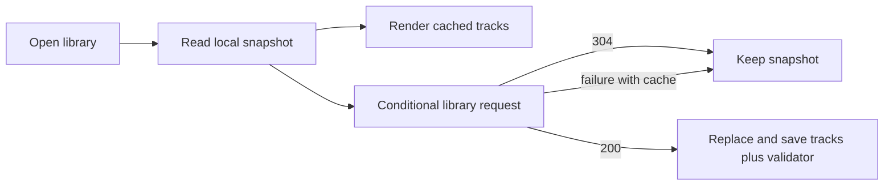
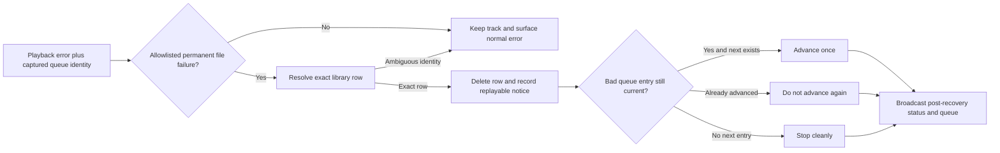

# Library API Response Cache - Plan

## Goal Capsule

- **Objective:** Make the personal library feel immediate on first open while keeping the current browse-to-play experience intact as the collection grows.
- **Product authority:** The library owner is the primary actor; the existing library browse and playback behavior remains the source of truth for product behavior.
- **Open blockers:** No product blocker remains. The current scale and latency baseline are unknown and must be measured before setting quantitative thresholds.
- **Execution profile:** Backend and frontend behavior change with unit, integration, and browser-oriented verification.
- **Tail ownership:** LFG owns simplification, review, residual handling, commit, PR creation, and CI watch after implementation.

## Product Contract

### Summary

Extend the existing lightweight library snapshot flow so the latest usable library appears immediately and a live refresh happens quietly in the background. Keep the current library response contract and defer pagination, detail-on-demand records, and external cache infrastructure unless measurement shows the preserved contract cannot scale.

### Problem Frame

The initial library read currently returns an unbounded collection of full track records. As the personal library grows, the transfer, refresh, and browser work can grow with it even when the owner only wants to browse or start playback.

The product already has a client-side library snapshot that can paint before the live response completes. The work should make that perceived-speed path dependable without making stale data the permanent source of truth.

### Key Decisions

- K1. **Cached-first startup** — (session-settled: user-directed — chosen over fresh-data-only startup: remove the wait before browsing).
- K2. **Preserve the current library contract** — (session-settled: user-directed — chosen over summary-first or paginated browsing: avoid new loading states and playback disruption).
- K3. **Lightweight local caching** — (session-settled: user-directed — chosen over Redis or another external cache: address the observed startup pain without introducing service operations before measurement).
- K4. **Initial unfiltered library scope** — (session-settled: user-directed — chosen over optimizing every library read: keep one coherent first-version work unit).
- K5. **Recover from permanently unplayable tracks** — (session-settled: user-directed — chosen over leaving the bad row or halting playback: notify the owner, remove the library entry, and continue playback when a next queue entry exists).

### Actors

- A1. **Library owner:** Opens the library to browse albums and start playback.
- A2. **Library service:** Provides the current library snapshot and refreshes it when the owner opens or explicitly refreshes the library.

### Requirements

**Startup experience**

- R1. When a usable local library snapshot exists, the library view must render it without waiting for the live library response.
- R2. The live refresh must run without blocking interaction with the cached library and must replace the snapshot after a successful response.
- R3. When no local snapshot exists, the library must retain a clear loading state until the first live response succeeds or fails.

**Freshness and resilience**

- R4. A failed live refresh must leave a usable cached library visible, surface a non-blocking refresh-failure status, and surface a blocking error only when no cached library can support browsing.
- R5. A successful refresh must become the new local snapshot so later opens reflect the latest known library state.
- R6. Cached rows that refer to moved or removed files must not prevent the owner from continuing to browse or cause the cache to remain stale after a successful refresh; the next successful refresh must remove them.

**Compatibility and scope**

- R7. The initial version must preserve the existing browse, album grouping, and track playback behavior without requiring pagination or detail-on-demand loading.
- R8. The initial version must optimize the unfiltered initial library read; search and auxiliary library reads remain unchanged unless evidence shows they materially delay that experience.
- R9. The solution must not require operating a separate cache service as part of this work.
- R10. When the library has not changed, repeat opens must avoid making the owner wait through equivalent full-library work; the refresh must validate freshness and replace the snapshot only when newer content exists.
- R11. When playback confirms that a track is missing or permanently unplayable, the library must remove that track, show a non-blocking notification, and try the next queued track; if no next track exists, playback must stop cleanly.

### Key Flows

- F1. **Cached startup with successful refresh**
  - **Trigger:** The owner opens the library and a local snapshot exists.
  - **Actors:** A1, A2
  - **Steps:** Render the snapshot; begin the live refresh; replace the visible library and saved snapshot when fresh data arrives.
  - **Outcome:** The owner can browse immediately and sees fresh data when the refresh completes.
  - **Covered by:** R1, R2, R5, R7.

- F2. **Cached startup with refresh failure**
  - **Trigger:** The owner opens the library and the live refresh fails.
  - **Actors:** A1, A2
  - **Steps:** Keep the cached library visible; do not replace it with an empty state or show a blocking refresh error; retain the snapshot for the next attempt.
  - **Outcome:** The owner can continue browsing while freshness recovers on a later attempt.
  - **Covered by:** R2, R4, R6.

- F3. **First startup without a snapshot**
  - **Trigger:** The owner opens the library with no usable local snapshot.
  - **Actors:** A1, A2
- **Steps:** Show loading; request the live library; render and save a successful result, or show a retryable live error without presenting the empty-library state or scan action when the result is unknown.
- **Outcome:** The first successful load establishes the snapshot; a failed first load is clearly distinguished from a confirmed empty library.
- **Covered by:** R3, R4, R5.

- F4. **Explicit library refresh**
  - **Trigger:** A scan or owner-requested refresh changes the library.
  - **Actors:** A1, A2
  - **Steps:** Keep the current library usable while the updated result is obtained; replace the visible and saved snapshot after success.
  - **Outcome:** Removed or moved tracks disappear after the refresh and the next startup uses the corrected snapshot.
  - **Covered by:** R2, R5, R6.

- F5. **Playback recovery from a bad track**
  - **Trigger:** A cached or queued track is confirmed missing or permanently unplayable when playback starts or advances.
  - **Actors:** A1, A2
- **Steps:** Notify the owner with a bounded, user-facing reason; remove the track from the library and the visible/local snapshot; advance past the identified bad queue entry to the next queued track; stop cleanly when no next track exists.
- **Outcome:** One bad file does not strand the listening session, the removed row cannot be retried from the current library view, and the owner is told why the track was skipped.
- **Covered by:** R6, R11.

### Acceptance Examples

- AE1. **Cached startup:** Given a valid local snapshot and a slow live request, when the owner opens the library, then cached albums and tracks are visible before the live request completes and the view later updates with the live result.
  - **Covers:** R1, R2, R7.
- AE2. **No-cache startup:** Given no valid local snapshot, when the live request succeeds, then the owner sees the normal library result and a later open can use that result immediately.
  - **Covers:** R3, R5.
- AE3. **Offline cached startup:** Given a valid local snapshot and a failed live request, when the owner opens the library, then the cached library remains usable and the view does not become an empty error state.
  - **Covers:** R4, R6.
- AE4. **Unchanged repeat open:** Given a valid snapshot that matches the server library, when the owner opens the library again, then the snapshot remains immediately usable and the refresh does not replace it with an equivalent full result.
  - **Covers:** R10.
- AE5. **Refresh removes stale rows:** Given a cached row for a track that no longer exists, when a later refresh succeeds without that track, then the row is removed from the visible library and from the next-startup snapshot.
  - **Covers:** R5, R6.
- AE6. **Missing track advances playback:** Given a queued track whose file is confirmed missing, when playback reaches that track, then the owner sees a missing-track notification, the track is removed from the library, and the next queued track starts.
  - **Covers:** R6, R11.
- AE7. **Last bad track stops cleanly:** Given a queued track that is confirmed permanently unplayable and no later queued track exists, when playback reaches it, then the owner sees an unplayable-track notification, the track is removed, and playback stops without retrying the bad track indefinitely.
  - **Covers:** R11.

### Success Criteria

- The owner can begin browsing from a valid cached snapshot without waiting for the live response.
- A successful live refresh replaces the snapshot without requiring a manual reload.
- A failed refresh does not erase a usable cached library.
- Baseline and post-change measurements identify whether startup delay is dominated by server time, response transfer, or browser processing before any scale-specific redesign is chosen.

### Scope Boundaries

- **Deferred for later:** Summary-first records, pagination or incremental loading, and detail-on-demand metadata remain candidates only if measurements show the preserved full contract cannot scale.
- **Deferred for later:** Optimization of search, album/artist lists, and cover delivery is separate unless it is shown to block the initial unfiltered library experience.
- **Outside this work:** Selecting, deploying, or operating Redis or another external cache service.

### Dependencies and Assumptions

- The current client-side snapshot mechanism remains available as the starting capability.
- The library owner accepts that a cached snapshot can be briefly older than the server, provided a successful refresh corrects it and stale actions fail gracefully.
- Quantitative latency and payload targets will be chosen after a baseline is captured for representative library sizes.

### Outstanding Questions

**Deferred to execution validation**

- Capture baseline and post-change startup timings for representative library sizes.
- Confirm whether the conditional response removes the dominant repeat-open transfer cost before considering payload-shape redesign.

### Sources / Research

- `backend/src/api/mod.rs:254-266` — the library query accepts filters and the initial handler returns an unbounded `Vec<Track>` result.
- `backend/src/library/db.rs:529-607` — the database search supports an optional limit, but the initial handler passes no limit; unfiltered results are ordered by album, track, and title.
- `backend/src/types.rs:19-50` — `Track` includes playback identity, metadata, audio properties, cover fields, cue timing, file mtime, and source.
- `frontend/src/components/LibraryView.tsx:74-101` — the view reads a local snapshot alongside the live request, paints cached data, then replaces and saves the live result.
- `frontend/src/libraryCache.ts:3-77` — the lightweight IndexedDB snapshot with localStorage fallback is best-effort and keeps the network as source of truth.
- `frontend/vite.config.ts:37-70` — the service worker has a dedicated library cache policy and leaves other API routes network-only by default.
- `docs/plans/2026-07-14-001-feat-oxide-player-v1-plan.md:78-81` — the existing product plan establishes REST library browse/search behavior.
- `backend/src/state.rs:241-273` — existing status recovery removes confirmed missing files from the library and advances MPD when necessary; the new contract extends this path to permanent unplayable failures and owner notification.
- `frontend/src/App.tsx:56-69,100-117` — current application-level error handling surfaces transport failures through a shared banner.

## Planning Contract

### Key Technical Decisions

- KTD1. **Use a process-scoped library revision validator.** `LibraryDb` owns a mutation revision shared by its clones; mutations that affect `Track` rows advance it, and a process nonce prevents a stale validator from surviving a backend restart. This avoids a new persistent schema or cache service.
- KTD2. **Use conditional responses for the unfiltered library only.** The initial browse request can return `304 Not Modified` with no body when the client validator matches; filtered searches and auxiliary lists keep their current response behavior.
- KTD3. **Keep the local snapshot as the startup source.** The cache stores the validator beside tracks, accepts old snapshots without a validator, and writes the server validator after a successful full response.
- KTD4. **Represent playback recovery as a replayable WebSocket notice.** A notice is a bounded, additive event separate from `PlayerStatus.error`, with a monotonic identity, stable affected-track identity, and fixed user-facing reason (`missing` or `unplayable`). The latest notice is included in the next WebSocket snapshot so reconnecting or lagging clients can receive it; the frontend deduplicates by notice identity.
- KTD5. **Classify permanent track failures before deletion.** Confirmed missing-file errors and an allowlisted, file-level terminal decoder result are removable; generic decode, permission, mount, I/O, output, device, network, and other ambiguous errors are not removable and retain the row.
- KTD6. **Keep recovery data private and bounded.** Notices and validators never contain raw MPD errors, absolute paths, device details, or attacker-controlled unbounded text. The library response keeps `Cache-Control: private, no-cache` on both `200` and `304`; the opaque validator contains no track or path data.

### High-Level Technical Design

The unchanged-library path is:

- The bad-track path is:

### Sequencing and Constraints

- 1. Add and test the backend revision and conditional response before changing the client validator flow.
- 2. Add the recovery classifier and replayable notice event without changing the existing missing-file guard that protects against deleting a row whose backing path still exists.
- 3. Update the client cache and WebSocket union together, then connect notices to one accessible `ShortcutToast` surface in both the normal and kiosk branches.
- 4. Keep the app-owned cache as the sole `/api/library` cache policy: remove the service worker's broad pathname-only `NetworkFirst` route so filtered searches and stale service-worker `200` fallbacks cannot overwrite the IndexedDB snapshot. Do not cache status, queue, or playback mutations.
- 5. Do not add a new dependency or external service for this feature.

### System-Wide Impact

- Library reads gain validator headers, `Cache-Control: private, no-cache`, and a no-body unchanged response; the JSON track shape remains unchanged.
- Every `LibraryDb` clone shares the revision source, so scanner, cover, source, CUE cleanup, and playback-recovery mutations invalidate the next conditional read.
- The WebSocket event union gains an additive notice variant. Existing clients that do not understand it continue to process status and queue events, while the shipped frontend renders and deduplicates it; the latest notice is replayed in the initial snapshot.
- Removing a permanently unplayable track changes future library responses and the next cached snapshot; it does not remove the physical file.
- The dominant first-load cost may be JSON serialization or browser grouping rather than repeat transfer. The plan therefore proves conditional savings first and defers payload redesign.
- Permanent decoder-error matching must use an explicit allowlist of terminal file-level conditions; generic decode, permission, mount, I/O, output-device, and network failures must preserve the row and surface the normal error.
- MPD may auto-advance before the poller handles the error. Recovery must retain the failed queue song identity and CUE address captured at error detection, resolve deletion by exact library row identity, re-read current MPD state before advancing, clear the handled error idempotently, and broadcast post-recovery status and queue.
- The revision and full track read must be one consistent database snapshot: a matching validator is checked before the unfiltered query, while a changed validator returns rows and the revision from the same DB-locked operation.
- Recovery notices must be sanitized, bounded, replayable across WebSocket reconnect/lag, deduplicated in the client, and visible while kiosk mode is active.
- Existing clients and snapshots may lack validators. Missing validator metadata must fall back to a normal full request; the service worker must not provide an independent stale `/api/library` fallback.
## Implementation Units

### U1. Add library revision and conditional response

- **Goal:** Avoid retransmitting the unchanged unfiltered library while retaining the existing full track response.
- **Requirements:** R5, R8, R9, R10.
- **Files:** `backend/src/library/db.rs`, `backend/src/api/mod.rs`.
- **Approach:** Add a shared process-scoped revision and opaque validator token to `LibraryDb`. Advance it for every mutation that can change `Track` response data, including scan ingestion, cover metadata updates, source pruning, CUE cleanup, and stale-track deletion. Make the unfiltered library handler use one DB-locked snapshot operation: inspect the revision and compare `If-None-Match` before running the unfiltered search; return a bodyless `304` immediately when equal, otherwise read the complete rows and return those rows with the same revision-derived validator before releasing the lock. All mutation paths must bump the revision under that same coordination. Keep query-filtered responses compatible, preserve existing JSON fields, and apply `Cache-Control: private, no-cache` to both `200` and `304`.
- **Test scenarios:** A read does not change the validator; insert, cover update, source pruning, CUE cleanup, stale-track deletion, and playback deletion each change it; a matching validator short-circuits before the full search and returns `304` with no body; a non-matching or absent validator returns `200` with the complete track JSON and private cache policy; a concurrent mutation cannot pair an old body with a new validator or return a stale `304`; a backend restart cannot reuse a prior process validator.

### U2. Recover from confirmed unplayable tracks

- **Goal:** Remove confirmed bad library entries and keep playback moving without deleting files or misclassifying transient failures.
- **Requirements:** R6, R11.
- **Files:** `backend/src/state.rs`, `backend/src/types.rs`, `backend/src/library/db.rs`.
- **Approach:** Centralize MPD error classification into missing-file, allowlisted permanent file-level decode, and non-removable categories. For deletion, capture the failed queue song ID, URI, and CUE track address at the first error observation; resolve that identity to one library row and refuse deletion when identity is absent or ambiguous. Reuse the existing path-existence guard for missing files and add a targeted row deletion path for permanent file-level failures, preserving CUE siblings and never deleting the physical file. Record one bounded notice with a stable notice ID and fixed reason, retain it for WebSocket snapshot replay, and make handling idempotent by clearing the handled MPD error. Re-read MPD status/queue after database deletion; advance only if the failed queue entry is still current and a next entry exists, otherwise do not advance twice. Stop cleanly when no next queue entry exists, broadcast post-recovery status and queue, and signal the client to refresh/evict the affected library row.
- **Test scenarios:** Missing-file errors remove only rows with absent backing paths; allowlisted terminal decode failures remove the targeted row; generic decode, permission, mount, I/O, output/device, and network errors preserve the row; absent or ambiguous queue identity does not delete or advance; one bad current entry emits one notice and advances once; repeated poller ticks after recovery emit no duplicate notice or second advance; an auto-advanced entry is not advanced again; a bad last entry emits one notice and leaves playback stopped; CUE failures remove only the matching library track while retaining siblings and the shared audio file; post-recovery status and queue snapshots reflect the resulting MPD state.

### U3. Use validators in the client and render recovery notices

- **Goal:** Paint cached tracks immediately, avoid replacing them on `304`, persist the validator, and show bad-track notices without blocking playback.
- **Requirements:** R1, R2, R3, R4, R5, R7, R10, R11.
- **Files:** `frontend/src/api.ts`, `frontend/src/libraryCache.ts`, `frontend/src/components/LibraryView.tsx`, `frontend/src/types.ts`, `frontend/src/ws.ts`, `frontend/src/App.tsx`, `frontend/src/__tests__/libraryView.test.tsx`, `frontend/src/__tests__/ws.test.ts`.
- **Approach:** Extend the unfiltered library client call to return full data or not-modified metadata while leaving search callers on the existing track-array contract. Store an optional validator beside cached tracks and tolerate older snapshots. Load the cache before sending the conditional request, keep cached rows rendered during `304` or refresh failure, and write new tracks plus validator on `200`. Separate initial loading from background refreshing; expose refresh failure and `aria-busy` without replacing usable rows, and show a retryable alert instead of an empty-library state when the first request fails. Add the additive notice event to the TypeScript union and WebSocket state, deduplicate by notice ID, and render one bounded accessible polite notice in both normal and kiosk branches. On a notice, trigger a conditional library refresh when the view is mounted so the removed row and persisted snapshot are corrected; if it is not mounted, the next library open must perform that conditional refresh before treating the cached row as authoritative.
- **Test scenarios:** Cached rows render before a delayed request and remain interactive during refresh; a matching validator keeps the rows and avoids a replacement write; a `200` response replaces and persists tracks plus validator; an old snapshot without validator still loads and makes a full request; cached refresh failure keeps rows, exposes a non-blocking refresh-failure status, and leaves retry available; first-load failure does not render the empty-library scan state and exposes an accessible retryable error; notice events produce one bounded missing/unplayable toast, evict the affected visible row after refresh, update the saved snapshot, replay once after reconnect, and render in kiosk mode; an unknown event does not break status or queue handling.
- **Service-worker interaction:** Remove the dedicated broad `/api/library` `NetworkFirst` runtime route from `frontend/vite.config.ts`; the app-owned IndexedDB/localStorage cache and conditional API request are the only library cache path, while filtered `/api/library?q=...` requests remain network-only and unchanged.

## Verification Contract

### Required checks

| Check | Command or scenario | Exit signal |
| --- | --- | --- |
| Frontend unit behavior | `cd frontend && npm test` | Cache-first, conditional-response, notice, service-worker, and existing suites pass. |
| Frontend type/build gate | `cd frontend && npm run build` | TypeScript and Vite build succeed with a generated `frontend/dist/`. |
| Backend unit/integration behavior | `cargo test` | Database, API, state-recovery, and existing backend tests pass. |
| Unchanged response proof | API test with matching validator | Unfiltered library returns `304` with an empty body and private cache policy; changed revision returns full JSON. |
| Cached startup proof | LibraryView test with delayed network | Cached tracks render and remain usable before the live promise settles. |
| Playback recovery proof | State/API tests plus live smoke when MPD is available | Confirmed bad track produces one replayable notice, removes the exact library row, advances once when possible, and stops at the end. |

### Conditional checks

- Run `tests/ui-smoke.sh` when a running backend, frontend, and populated library are available. Extend the smoke assertions only if the existing environment can deterministically create a missing or permanently unplayable track.
- Capture baseline and post-change repeat-open timing and response sizes for representative library sizes. The hard byte-level gate is no body on a matching validator; no absolute latency target is invented before baseline data exists.

## Definition of Done

- R1–R11 map to implemented units and passing acceptance coverage.
- Reopening an unchanged library can render the local snapshot immediately and complete with a bodyless conditional response.
- A full response still contains the existing `Track` fields and preserves browse, album grouping, search, and playback callers.
- Confirmed missing and permanently unplayable tracks are removed from the library without deleting physical files, the owner receives one bounded replayable non-blocking notice in normal or kiosk mode, and playback advances or stops as specified without double-advance.
- Transient output, device, network, permission, mount, and ambiguous decoder failures do not remove library rows.
- `cd frontend && npm test`, `cd frontend && npm run build`, and `cargo test` pass.
- No external cache service, speculative pagination, abandoned implementation, or broad service-worker library fallback remains in the diff.
