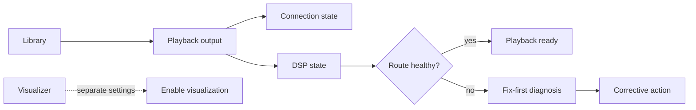
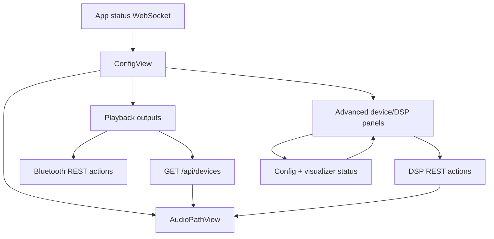

# Settings Audio Path UX - Plan

## Goal Capsule

- **Objective:** Make Oxide Settings understandable and actionable for configuring playback outputs, diagnosing failures, and verifying DSP without requiring users to understand backend subsystems.
- **Product authority:** The primary audience is a two-tier audience: a household operator or audio enthusiast should get a simple path, while a technical owner can open advanced details.
- **Current work boundary:** This plan owns the playback setup and health experience plus separate visualization settings treatment. Library, server, storage, and power administration remain available but are not deeply redesigned here.
- **Open blockers:** None at the requirements level. Planning must determine which existing runtime and configuration signals can support each user-facing health state.

## Product Contract

### Summary

Settings will present one understandable playback path from the library to a real listening output, with route health, contextual correction, and DSP state visible at the point of use. Static/system outputs such as the visualizer will be excluded from playback-device selection and managed through separate settings.

### Problem Frame

The current Settings surface is one long composition that mixes server configuration, library folders, runtime playback outputs, saved output configuration, Bluetooth pairing, Bluetooth input, DSP infrastructure, DSP profiles, and power controls. The current implementation nests both device management and DSP editors inside generic cards, so related controls are separated while unrelated controls compete for attention.

Users must currently distinguish runtime output state from saved device configuration, Bluetooth lifecycle actions, per-output DSP toggles, and DSP profile application. The interface also exposes MPD, ALSA, CamillaDSP, sample-rate, mixer, and DoP terminology before a user knows which concept is relevant. Configuration changes have different application scopes, including immediate effects, MPD restart, Oxide restart, and an explicit DSP Apply action.

The redesign is driven by the need to answer “why did setup fail?” quickly, then provide the smallest corrective action. It must cover DACs and other real playback outputs as first-class outputs, not treat Bluetooth as the entire device model.

### Key Decisions

- **Route-first audio health over subsystem browsing** *(session-settled: user-approved — chosen over a setup wizard and goal-only sections: it prioritizes diagnosis while preserving direct access for returning users).* Governs R1, R3, R6, R7.
- **One playback-output model over Bluetooth-centered management** *(session-settled: user-directed — chosen over treating Bluetooth as the device model: DACs and other real listening outputs must be first-class).* Governs R2, R4, R5.
- **Audio setup first, broader administration later** *(session-settled: user-directed — chosen over a whole Settings information-architecture rewrite: the highest-value first release is the route and health summary).* Governs R10.
- **Fix-first diagnostics over a technical console** *(session-settled: user-approved — chosen over prominent raw logs: users need a plain-language correction, with technical details available when needed).* Governs R6, R7, R8.
- **Destructive Bluetooth actions are advanced actions** *(session-settled: user-directed — chosen over exposing Forget and Remove output beside Connect: routine connection management should be safe and obvious).* Governs R9.

### Requirements

**Playback route and output model**

- R1. The default Settings experience must show the current playback route, or an attention state when no single real playback output is active.
- R2. The playback output model must include DACs, Bluetooth speakers or headphones, and other real listening outputs while excluding static/system outputs such as the visualizer from playback selection.
- R3. Each playback output must communicate its relevant lifecycle state without collapsing distinct states into one label, including configured, available, enabled, connected, active, and unavailable where applicable.
- R4. Output setup must present output-specific actions in one coherent context, while keeping connection-specific actions such as Bluetooth pairing and connection contextual to the selected output.
- R5. The playback surface must make the relationship between the selected output, its DSP capability, its DSP state, and the active route understandable without requiring users to navigate between unrelated subsystem sections.

**Diagnostics and recovery**

- R6. An unhealthy output or route must lead with a plain-language diagnosis that identifies the affected stage and presents one primary corrective action.
- R7. When a failure requires multiple checks, the interface must provide a short contextual correction checklist that distinguishes actionable fixes from information-only conditions.
- R8. The interface must expose technical details or logs on demand without making raw backend terminology the default recovery experience.
- R9. The interface must communicate whether a change is live, requires an MPD restart, requires an Oxide/server restart, or remains a draft until the user applies it.

**Bluetooth and destructive actions**

- R10. Bluetooth pairing, connection, and disconnection must use the same playback-output mental model as DAC and other playback outputs.
- R11. Forgetting a Bluetooth device and removing a managed output must be hidden behind an advanced action surface that explains the consequence before confirmation.
- R12. Bluetooth unavailable, not-yet-loaded, empty, paired, disconnected, and connected states must be distinguishable; unsupported Bluetooth must not appear as an indefinite loading state.

**DSP and visualization**

- R13. DSP setup must first verify whether the selected output supports DSP and whether the selected profile is applied to the active route before presenting detailed EQ editing as the primary task.
- R14. DSP status must distinguish support, enablement, profile application, and whether audio is currently passing through DSP.
- R15. The DSP experience must support simple profile selection or activation first, with detailed EQ editing, import, export, mode, and resampling controls available as an advanced editing step.
- R16. Visualization must have a separate settings area with an explicit enable/disable state and visualization-specific status or capture details; visualization must not appear as a selectable playback output.

### Actors

- A1. **Listener or household operator:** Needs to choose a playback output, connect it, recover playback, and understand whether sound is being processed.
- A2. **Audio enthusiast:** Needs to verify DSP behavior and tune or import EQ without first learning infrastructure vocabulary.
- A3. **Technical owner:** Needs access to output configuration, diagnostic details, and destructive or system-level actions when the simple path is insufficient.
- A4. **Oxide playback system:** Supplies runtime output, connection, DSP, and error states that the interface translates into user-facing health and recovery states.

### Key Flows

- F1. **Healthy playback route**
  - **Trigger:** The user opens Settings while a real playback output is active.
  - **Actors:** A1, A4.
  - **Steps:** Show the library-to-output route; identify the active output; show connection health; show DSP support and active state; allow the user to open stage-specific controls.
  - **Outcome:** The user can tell where audio is playing and whether DSP is active without opening advanced settings.
  - **Covers:** R1, R3, R5, R14.

- F2. **No route or unresolved route**
  - **Trigger:** No single real playback output is active or the playback route cannot be resolved.
  - **Actors:** A1, A4.
  - **Steps:** Replace the route summary with a clear choose-or-resolve state; list eligible playback outputs; omit static/system outputs; identify the next setup action.
  - **Outcome:** The user is not left guessing which device is selectable or why the route is absent.
  - **Covers:** R1, R2, R3, R12, R16.

- F3. **Output setup and connection**
  - **Trigger:** The user selects a DAC, Bluetooth device, or another playback output that is not ready.
  - **Actors:** A1, A3, A4.
  - **Steps:** Show the output’s lifecycle state; provide the relevant setup or connection action; surface restart requirements when applicable; keep Forget and Remove output in advanced actions.
  - **Outcome:** The user can move from unavailable or disconnected to a usable playback route without interpreting raw device configuration fields.
  - **Covers:** R3, R4, R9, R10, R11, R12.

- F4. **DSP verification and editing**
  - **Trigger:** The user opens DSP for a selected playback output.
  - **Actors:** A2, A3, A4.
  - **Steps:** Show DSP support and route application state; identify the active profile or missing profile; offer activation first; expose EQ, import/export, mode, and resampling editing after route status is clear; make the Apply boundary visible.
  - **Outcome:** The user can tell whether DSP is possible and active before changing filter values.
  - **Covers:** R5, R13, R14, R15.

- F5. **Failure diagnosis and correction**
  - **Trigger:** An output or DSP stage reports an unhealthy state.
  - **Actors:** A1, A2, A3, A4.
  - **Steps:** Identify the affected stage; explain the likely cause in plain language; present one primary corrective action; show a short checklist when multiple conditions must be checked; offer technical details or logs on demand; report the application scope of the correction.
  - **Outcome:** The user can attempt a targeted correction without searching across Settings or guessing which restart or Apply action is required.
  - **Covers:** R6, R7, R8, R9.

- F6. **Visualization settings**
  - **Trigger:** The user wants to enable or troubleshoot visualization.
  - **Actors:** A1, A3, A4.
  - **Steps:** Open visualization settings separately from playback outputs; show enablement and capture status; provide visualization-specific corrective details when unavailable; keep the visualizer out of playback selection.
  - **Outcome:** Visualization is understandable as a separate feature rather than an audio destination.
  - **Covers:** R2, R16.

### Acceptance Examples

- AE1. **Active DAC route:** Given a configured and enabled DAC is the active playback output, when the user opens Settings, then the route identifies the DAC as the listening destination and shows its DSP support and current DSP application state.
- AE2. **Bluetooth as one output type:** Given a paired but disconnected Bluetooth speaker and a configured DAC, when the user opens the output setup surface, then both are presented as playback outputs with distinct connection states and the Bluetooth row offers Connect rather than exposing advanced removal actions.
- AE3. **Static output omitted:** Given the visualizer is available as a runtime/static output, when the user chooses a playback output, then the visualizer is absent from the playback list and an independent Visualization setting exposes its enablement state.
- AE4. **DSP unsupported:** Given an output does not support DSP, when the user opens DSP for that output, then the interface explains that limitation and does not imply that a profile can be applied.
- AE5. **DSP draft versus active state:** Given the user edits or imports an EQ profile but has not applied it, when the user views the route, then the interface distinguishes the draft from the active DSP state and tells the user how to apply it.
- AE6. **Restart scope:** Given a correction requires an MPD or Oxide restart, when the user invokes it, then the interface identifies what will restart and does not present the change as live before the restart completes.
- AE7. **Bluetooth unavailable:** Given Bluetooth is unsupported or unavailable, when the user opens device management, then the interface shows an unavailable state with corrective or explanatory details instead of an indefinite loading state.
- AE8. **Failure recovery:** Given an output or DSP stage is unhealthy, when the user opens its diagnosis, then the first view contains a plain-language cause and one primary corrective action, with technical details available separately.

### Scope Boundaries

**Deferred for later**

- Deep information-architecture redesign of library folders, server/network settings, storage paths, and server power controls.
- Broader administration workflows that do not affect playback-output setup or visualization enablement.
- A complete guided first-run wizard spanning every server subsystem.

**Outside this product’s identity**

- Treating Oxide Settings as a raw MPD, ALSA, or CamillaDSP console by default.
- Treating Bluetooth as the only meaningful playback path.
- Treating static/system outputs as user-selectable listening destinations.

### Dependencies and Assumptions

- Existing runtime and configuration signals can be mapped to distinct user-facing states for playback outputs, Bluetooth, DSP, restart scope, and visualization.
- The playback route can identify a meaningful active output or explicitly report that no single route is active.
- Technical details and logs remain available to technical owners even when the default experience translates them into plain-language diagnoses.
- Device setup may have different application boundaries; the interface must reveal those boundaries rather than flatten them.

<!-- ce-section: work-relationships -->
## How This Work Fits Together

This plan owns the playback setup and health experience, including DACs, Bluetooth outputs, DSP verification, and separate visualization settings. The current broader Settings surface remains the surrounding context rather than active scope for this plan.

- **Can proceed independently of:** Deep library-source administration redesign.
- **Can proceed independently of:** Server, storage, startup, network, and power administration redesign.
- **Shares:** Existing device, Bluetooth, DSP, and visualization capabilities; this work changes how users understand and recover them.
- **Still to decide:** Whether deferred administration areas later become separate Settings sections or separate top-level workflows.

### Sources / Research

- `frontend/src/App.tsx` — Settings is currently one top-level route with no nested Settings routes.
- `frontend/src/components/ConfigView.tsx` — current long page composition, mixed restart scopes, and nested device/DSP sections.
- `frontend/src/components/DevicesView.tsx` — runtime outputs, saved device configurations, Bluetooth lifecycle, Bluetooth input, and AirPlay presentation.
- `frontend/src/components/DspView.tsx` — per-output DSP profiles, mode selection, EQ editing, import/export, and Apply boundary.
- `frontend/src/types.ts` — current distinctions among runtime output state, DSP profiles, Bluetooth state, device configuration, and visualization configuration.
- `frontend/src/api.ts` — separate device-config, runtime output, DSP, Bluetooth, and visualization-related API contracts.
- `backend/src/api/mod.rs` — current DSP profile application behavior used to verify that UI Apply is a user-facing application boundary rather than a separate engine model.

## Planning Contract

### Key Technical Decisions

- KTD1. Keep the authoritative live output shape in `PlayerStatus.outputs`; enrich `GET /api/devices` with per-output role, capability, and diagnostic detail as a separate device-output contract. U1 owns only those per-output facts; U2 owns frontend joins, freshness, and route reduction. Join by MPD runtime ID when present, then managed config identity or Bluetooth address; expose missing/stale joins explicitly. Do not extend the shared status wire type with device-only fields. Governs R1-R5, R10, R12-R14.
- KTD2. Classify internal outputs on the backend from managed fragment identity. Mark the managed visualizer FIFO and `camilladsp-loopback` as system outputs; mark configured listening outputs as playback outputs; keep unknown outputs visible in the advanced area but not playback-selectable until their role is confirmed. Governs R2, R16.
- KTD3. Let U2 derive route health from enabled playback outputs plus `PlayerStatus.state`, `PlayerStatus.error`, and status freshness. Enabled is not equivalent to actively playing. Distinguish no eligible output, one configured route that is stopped/errored, multiple enabled outputs, stale status, and unavailable service. For multiple outputs, selection is inspection-only until the user explicitly confirms disabling extras; no automatic choice or persisted selector. Governs R1, R3, R5.
- KTD4. Represent DSP support, configured profile, saved configuration, and confirmed active route as separate states. A reload failure or unreachable CamillaDSP may leave saved configuration changed but active routing unconfirmed; typed Apply results and retrying the same Apply operation must expose that state without claiming no side effect. Unsupported, disconnected/inactive, and missing-profile reasons remain distinct. Governs R5, R13-R15.
- KTD5. Keep visualizer enablement in the existing config save boundary, but expose configured-versus-applied and runtime lifecycle states: disabled, enabled/pending-restart, running, waiting-for-capture, and startup/runtime-error. `waiting-for-capture` is canonical; “silent” is explanatory detail. Changes to capture configuration remain restart-required because `VisualizerAnalyzer` starts during application construction. Governs R9, R16.
- KTD6. Keep the existing REST and WebSocket split. Use the status WebSocket for live player/output state plus explicit connected/stale/unavailable metadata, REST for per-output/DSP/visualizer detail and actions, and local draft state for unapplied DSP edits. Make `ConfigView` the Settings snapshot owner and pass status freshness, selection, and refresh/reconcile context to child surfaces. Governs R3, R6-R9, R13-R16.
- KTD7. Use progressive disclosure implemented with native buttons and `aria-expanded`, not a new navigation library or route hierarchy. The exact order is always-visible route summary, eligible playback outputs and selected-output controls/DSP, sibling Visualization settings, then collapsed administration groups. Settings remains one top-level route; this plan does not redesign library/server/storage/power IA. Governs R4, R8-R11, R15-R16.

### High-Level Technical Design

The frontend will let `App` pass both the latest player snapshot and its connection freshness metadata into `ConfigView`, which owns one enriched device snapshot and its refresh boundary. The route summary joins live status to device detail using the identity rules in KTD1, distinguishes stopped/error/stale/unavailable from a legitimate zero-output state, and passes selected-output context plus refresh/reconcile callbacks to output and DSP panels. Config loading remains an independent boundary so a config failure does not hide route health.

The backend will keep `PlayerStatus.outputs` unchanged, add a typed diagnostic/role contract to `GET /api/devices`, and factor classification/state derivation into deterministic helpers with fixture coverage. It will add a typed visualizer runtime-status response backed by observable analyzer state, while reusing the existing whole-config PUT for enablement and capture settings. The analyzer status must distinguish a healthy publisher/WS from actual capture readiness and represent FIFO waiting as non-terminal.

### Implementation Constraints

- Preserve CSS Modules and the existing dark-only visual language. Do not add Tailwind, a component library, a router, or a state/data library.
- Keep `App.tsx` as the owner of the existing player status WebSocket. Pass status, connected/stale/error semantics, and last-snapshot freshness into Settings rather than opening another status connection.
- Keep destructive confirmation overlays accessible and consistent with the existing in-app modal pattern.
- Keep MPD output runtime IDs distinct from database track IDs and maintain a stable selection identity across MPD restarts using managed config names or Bluetooth addresses.
- Keep raw MPD device configuration available to technical owners, but place it behind an advanced output configuration surface.
- Treat Bluetooth 503 responses, initial loading, loaded-empty, scan-in-progress, scan-error, and retry/cancel as separate UI states. Do not use an empty device list as a loading sentinel.
- Keep visualizer configuration changes explicit about restart scope. Do not imply that toggling `visualizer_fft` can restart the capture analyzer in place unless the backend lifecycle is changed as part of the unit.
- Avoid a sample-level DSP claim. Use route/application terminology supported by manager state and reload result.
- Do not claim physical DAC availability from an enabled MPD output alone; label configured/runtime-known facts separately.
- Use responsive stacking at the existing narrow breakpoint, 44px minimum touch targets, semantic dialogs with focus/escape/restore behavior, disclosure `aria-controls`, and live-region announcements for route, restart, and error transitions.

### Sequencing

1. Add backend response/state contracts and tests for playback-versus-system output classification, route/DSP diagnostics, and visualizer runtime status.
2. Add frontend types/API wrappers and the route-first Settings shell using those contracts.
3. Refactor playback output and Bluetooth management into the route surface plus advanced configuration, preserving existing actions and application-scope banners.
4. Rework DSP presentation around selected-output verification and advanced editing.
5. Add separate visualization settings and runtime status.
6. Extend component tests, route tests, and the Settings browser smoke; run the full frontend build/test and backend test gates.

- **Live route precedence:** U2's reducer uses connected/stale/error metadata first, then `PlayerStatus.state`/`error`, then joined eligible-output state; an enabled output alone never renders healthy playback. Add fixtures for playing/paused/stopped, MPD error, WS disconnect after a healthy snapshot, output-query failure, and numeric MPD output-ID replacement.
- **Multiple MPD outputs:** MPD can report multiple enabled outputs. Selection first inspects a candidate; the primary corrective action explicitly disables the other outputs after confirmation. Success waits for live status to show one enabled route; failure or cancel leaves all outputs and attention state unchanged.
- **Output identity:** Existing DSP matching depends on exact managed config names and ALSA device strings (`backend/src/api/mod.rs:693-712`). Keep those identifiers in the data layer; show friendly names in the default surface. Paired-but-unconfigured Bluetooth devices remain connection/setup candidates until a managed playback output exists.
- **Snapshot joining:** `/api/devices` and the status WebSocket have different freshness and failure boundaries. Preserve stale/missing joins and keep live route health visible when detail refresh fails.
- **Bluetooth capability:** The dedicated Bluetooth endpoint returns 503 when unavailable, while `/api/devices` currently folds Bluetooth state into output diagnostics. Preserve the dedicated availability result, make frontend API errors status-aware, and give unavailable state a terminal retry path. Connect partial success must offer retry provisioning or disconnect recovery.
- **DSP observability:** `DspManager::active_device` records route activation, not audio samples. Apply can persist before reload confirmation; expose saved-but-not-active and retry/reconcile states. Do not leave stale active-device UI after direct output disable.
- **Visualizer lifecycle:** Capture starts in `VisualizerAnalyzer::new` and startup/runtime failures are currently log-only (`backend/src/visualizer/mod.rs:137-150,289-330,495-529`). The status unit must make configured/applied, running, waiting-for-capture, and failure observable without changing capture timing unintentionally.
- **Restart semantics:** Model MPD restart and Oxide/process restart as separate domains, each with `saved → pending → restarting → applied/failed`; failure retains pending for retry, cancel only dismisses the current prompt, and pending clears only after a fresh applied snapshot.

### Research Breadcrumbs

- `backend/src/api/mod.rs:673-758` — current output response and DSP/connection derivation.
- `backend/src/api/mod.rs:779-846` — current output/DSP transitions and route switching.
- `backend/src/api/mod.rs:895-1064` — managed output configuration and MPD restart semantics.
- `backend/src/api/bluetooth.rs:127-327` — Bluetooth availability, lifecycle, and input contracts.
- `backend/src/dsp/camilladsp.rs:122-195,206-251` — profile persistence, active-device state, and reload acknowledgement.
- `backend/src/visualizer/mod.rs:137-180` — startup capture and source selection; no current health model.
- `frontend/src/App.tsx:66-69,338` — authoritative player status and Settings mount.
- `frontend/src/components/DevicesView.tsx:26-83,448-764` — current runtime/config/Bluetooth aggregation and the 503 loading bug.
- `frontend/src/components/DspView.tsx:79-224,225-425,430-504` — local draft, Apply boundary, import/export, and profile list.
- `frontend/src/components/ConfigView.tsx:28-69,148-350` — config save/restart boundary and current mixed card composition.
- `frontend/src/components/VisualizerControls.tsx:41-124` — existing visualizer tuning persistence pattern.

### U1. Enrich playback-output diagnostics and route contracts

- **Goal:** Give the frontend stable, deterministic facts for playback-versus-system output classification, output capability, DSP diagnostics, and snapshot join keys.
- **Requirements:** R2, R5, R12-R16.
- **Files:**
  - `backend/src/api/mod.rs`
  - `backend/src/devices/config_fragment.rs`
  - `backend/src/types.rs` only for distinct backend response types; do not extend shared `OutputDevice`
  - `backend/src/api/mod.rs` inline tests
  - `frontend/src/types.ts`
  - `frontend/src/api.ts`
- **Approach:**
  - Keep `PlayerStatus.outputs` unchanged. Add a distinct `/api/devices` output contract with machine-stable role/state/diagnostic codes, optional technical detail, and a redaction boundary for raw paths and backend identifiers. Frontend owns all user-facing diagnostic copy.
  - Factor pure per-output classification/capability helpers from the handler so fixture tests do not require MPD or BlueZ. The handler may join live MPD/config/Bluetooth/DSP data, but must preserve unavailable and partial-source details for U2.
  - Classify the managed `visualizer` FIFO and `camilladsp-loopback` as system outputs from managed identity. Keep configured listening outputs as playback outputs. Keep unknown outputs visible with an advanced-only conservative role.
  - Return stable selection keys and diagnostic-code precedence for configured ALSA/Bluetooth outputs, unsupported output types, disconnected outputs, missing profiles, and reload errors.
  - Keep configured-Bluetooth-output diagnostics separate from paired-but-unconfigured Bluetooth inventory; the latter remains a setup candidate handled by U3.
- **Test Scenarios:**
  - Pure fixtures mark the managed visualizer FIFO and `camilladsp-loopback` as system outputs, keep unknown outputs visible, and make unknown outputs non-selectable.
  - A configured ALSA output is a playback output with configured/runtime-known state, not physical-availability proof.
  - A configured MPD Bluetooth output reports disconnected/actionable state; a paired-only Bluetooth device is not synthesized as a playback output.
  - Per-output capability and diagnostic-code precedence distinguishes unsupported, disconnected/inactive, missing-profile, and reload-error cases.
  - A changed numeric MPD runtime ID returns a stable join key; route-state and freshness fixtures remain owned by U2.
- **Verification:** Run the focused inline API/device classification tests and frontend build during implementation; U6 owns the full gates.
- **Dependencies:** None.

### U2. Build the route-first Settings shell

- **Goal:** Make the first Settings view answer where playback is routed and which stage needs attention.
- **Requirements:** R1-R8, R10, R12-R16.
- **Files:**
  - `frontend/src/App.tsx`
  - `frontend/src/components/ConfigView.tsx`
  - `frontend/src/components/ConfigView.module.css`
  - `frontend/src/components/AudioPathView.tsx`
  - `frontend/src/components/AudioPathView.module.css`
  - `frontend/src/components/AudioPathView.test.tsx`
  - `frontend/src/components/ConfigView.test.tsx`
  - `frontend/src/__tests__/appRouting.test.tsx`
- **Approach:**
  - Pass `PlayerStatus | null` plus the status hook's connected/error or equivalent freshness metadata from `App` into `ConfigView`; do not create a second WebSocket.
  - Make `ConfigView` the owner of one device snapshot and its refresh boundary. Keep route-health rendering independent from `/api/config` loading/error so config failure does not hide a healthy or unavailable route summary.
  - Render in this order: always-visible route summary; eligible playback outputs and selected-output controls/DSP; sibling Visualization settings; collapsed library, server, storage, power, and startup administration.
  - Use enriched device data to filter system outputs and display friendly lifecycle, connection, and DSP states. Keep unknown outputs visible only in advanced detail, and keep technical details behind disclosures.
  - Use a stable selected-output identity (managed config name/Bluetooth address with runtime ID as a current join key). Clear or mark selection unavailable when it disappears or is recreated.
  - For multiple outputs, selecting a candidate is inspection-only; the primary resolve action explicitly disables other outputs after confirmation. Success waits for live status to show one enabled route; failure/cancel leaves all outputs unchanged.
  - Scope DSP drafts to the current output/profile. On switch, offer Keep editing (cancel switch) or Discard and switch; never carry an unapplied draft into another output or Apply it to the new output.
  - Add stage-level focus/selection state so selecting an output opens contextual controls and DSP without adding a Settings subroute. Preserve the existing administration IA in its collapsed wrapper.
  - Use per-stage error/notice ownership so Bluetooth scan/input failures cannot overwrite route or output diagnosis. Preserve existing reboot/power confirmation and separate MPD versus Oxide/process restart notices. Keep `ConfigView.test.tsx` on a complete `Config` fixture or explicitly mock child surfaces when a test does not exercise them.
  - Assign ConfigView composition to U2; U3/U5 extend its existing slots and styles only through that contract, avoiding competing Settings shells.
  - At the existing narrow breakpoint, stack route/output content; keep controls at least 44px, dialogs keyboard-operable with focus restore/Escape, and route/restart/error changes announced through status/alert regions.
- **Test Scenarios:**
  - Settings renders healthy DAC, stopped, paused, MPD-error, stale-after-disconnect, unavailable, zero-output, and multiple-output states with correct precedence.
  - Settings omits system outputs and keeps paired-only Bluetooth devices in the setup flow rather than inventing a playback output.
  - Config 500 or slow load leaves route health visible with an independent retry state.
  - Multiple-output choose → explicit disable-extra → live single-route, failure, and cancel transitions preserve the exact enabled-output state.
  - Selecting an output survives a runtime-ID change by stable identity, and removal/disconnect invalidates selection without showing stale DSP status.
  - Switching with a dirty DSP draft covers keep-editing, discard-and-switch, and no-Apply-to-new-output behavior; selection action success, failure, and cancel remain localized.
  - Technical details remain hidden until requested; unknown outputs are advanced-only; errors expose one primary corrective action.
  - Heading order, disclosure defaults, narrow layout, keyboard traversal, status announcements, existing version/startup checkbox/restart notices/power confirmation, `/settings`, and render-level popstate behavior remain covered.
- **Verification:** Focused Vitest suites for `AudioPathView`, `ConfigView`, and routing, followed by frontend build; U6 owns the full gates.
- **Dependencies:** U1.

### U3. Refactor output and Bluetooth management around playback outputs

- **Goal:** Make DAC and Bluetooth setup share one output workflow while keeping raw configuration and destructive actions advanced.
- **Requirements:** R2-R4, R6-R12.
- **Files:**
  - `frontend/src/components/DevicesView.tsx`
  - `frontend/src/components/DevicesView.module.css`
  - `frontend/src/components/DevicesView.test.tsx`
  - `frontend/src/api.ts`
  - `frontend/src/types.ts`
  - `backend/src/api/bluetooth.rs` only if a missing lifecycle diagnostic is confirmed during implementation
- **Approach:**
  - Keep U2 as the owner of ConfigView composition and have U3 supply output/Bluetooth panels through the selected-output and refresh contract; do not create a second Settings shell.
  - Refactor only playback output status/actions, managed-output configuration, and Bluetooth connection/pair/scan lifecycle into the route surface. Leave Bluetooth input and AirPlay sections in their existing advanced/informational treatment.
  - Merge `/api/devices`, `/api/devices/configs`, and Bluetooth data through explicit independent loading/error models. Make API errors status-aware with a typed HTTP status instead of parsing `e.message` for `503`; preserve loaded snapshots while marking them stale on refresh failure.
  - Keep paired-but-unconfigured Bluetooth devices as setup candidates. Connect creates or updates the managed MPD fragment, but runtime output visibility still depends on MPD reload/restart; show connected-but-not-yet-visible/provisioning-failed states with retry or disconnect recovery rather than claiming a route is ready.
  - Use friendly output labels in the primary surface. Keep raw output type, device, format, mixer, and DoP fields in an advanced editor with explanations.
  - Keep Connect, Disconnect, Pair, and Scan in the primary Bluetooth flow. Put Forget and Remove output in an advanced menu with consequence text and confirmation. Reload output/config snapshots after removal and reset scan results on a new or cancelled scan.
  - Preserve the MPD restart-pending banner and make its scope visible next to the changed output. Associate errors with their affected resource/action so scan or A2DP-input failures cannot replace route diagnosis.
  - Render stable diagnostic codes from U1 as frontend-translated explanations with optional technical detail.
- **Test Scenarios:**
  - A USB DAC and configured Bluetooth speaker appear as playback outputs with distinct configured/ready/disconnected states.
  - A paired-only device remains a Bluetooth setup candidate; paired/disconnected shows Connect, connected shows Disconnect, and unpaired shows Pair.
  - Bluetooth 503 is terminal unavailable with retry, successful empty is empty, scan is scanning, scan failure is actionable, and cancel ends scanning without stale results.
  - A visualizer-like system output never appears in the playback list.
  - Forget and Remove output are absent from the primary action row, require advanced confirmation, reload state after success, and preserve state after cancel/failure.
  - Output enable/disable, DSP toggle, MPD restart success/failure, include warning, config create/edit/delete, and concurrent action errors preserve existing API calls and notices.
- **Verification:** Focused `DevicesView` Vitest suite and frontend build; U6 owns the full gates.
- **Dependencies:** U1 and U2.

### U4. Reframe DSP around route verification and advanced editing

- **Goal:** Let users verify DSP support and active routing before editing EQ or resampling settings.
- **Requirements:** R5-R9, R13-R15.
- **Files:**
  - `frontend/src/components/DspView.tsx`
  - `frontend/src/components/DspView.module.css`
  - `frontend/src/components/DspView.test.tsx`
  - `frontend/src/components/EqGraph.tsx`
  - `frontend/src/components/EqGraph.test.tsx`
  - `frontend/src/components/DevicesView.tsx`
  - `frontend/src/types.ts`
  - `frontend/src/api.ts`
  - `backend/src/dsp/camilladsp.rs`
  - `backend/src/api/mod.rs`
  - `backend/src/dsp/camilladsp.rs` and `backend/src/api/mod.rs` inline tests
- **Approach:**
  - Accept selected-output context, refresh, and reconcile callbacks from the Settings shell. Show support, configured profile, saved state, confirmed route activation, and application status before the editor.
  - Keep the existing draft model, stable band identity, canonical frequency order, import/export behavior, and Apply boundary.
  - Make detailed mode, target rate, resampling quality, preamp, EQ graph, filter rows, and import/export controls an advanced editing region. Keep the primary action focused on selecting or applying the profile.
  - Return a typed result from the existing DSP Apply action distinguishing persisted profile/configuration from reload-confirmed active routing. Retrying the same Apply operation is the reconcile action; do not mark `active_device` on an unconfirmed reload.
  - Use “DSP route active” or equivalent wording backed by `dsp_enabled`/active-device state. Do not state that audio samples passed through DSP without new backend telemetry.
  - Keep unsupported, disconnected/inactive, missing-profile, saved-but-not-active, and reload-error states distinct, with retry/reconcile when Apply persisted but active confirmation failed.
  - On output switch, preserve a dirty draft only with explicit user confirmation; discard/cancel must be observable and must not apply the draft to the new output. Refresh route/device detail after Apply success or reconciliation.
- **Test Scenarios:**
  - Unsupported outputs show the stable reason and do not offer enabled DSP action; disconnected/inactive and missing-profile states have different copy/actions.
  - A supported output with an active DSP route shows active state and profile identity.
  - An imported profile changes the draft and does not call `setDsp` until Apply.
  - Apply success refreshes route/profile state; reload refusal/timeout distinguishes saved-but-not-active and preserves the draft; retry/reconcile success and failure are covered.
  - Switching with a dirty draft covers keep-editing, discard-and-switch, and cancel; disabling the DSP-routed output cannot leave stale active-device UI.
  - Bit-perfect and Resample + DSP preserve current field enablement; existing preamp, EQ graph, import, export, sorting, and remove-band coverage remains green.
- **Verification:** Focused `DspView`/`EqGraph` Vitest suites and frontend build; U6 owns the full gates.
- **Dependencies:** U1 and U2.

### U5. Add separate visualization settings and runtime status

- **Goal:** Make visualization an explicit feature setting rather than a playback output.
- **Requirements:** R2, R8-R9, R16.
- **Files:**
  - `frontend/src/components/VisualizationSettings.tsx`
  - `frontend/src/components/VisualizationSettings.module.css`
  - `frontend/src/components/VisualizationSettings.test.tsx`
  - `frontend/src/types.ts`
  - `frontend/src/api.ts`
  - `backend/src/visualizer/mod.rs`
  - `backend/src/api/mod.rs`
  - `backend/src/state.rs`
  - `frontend/src/components/VisualizerControls.tsx` only if reused; otherwise leave kiosk tuning unchanged
- **Approach:**
  - Add an explicit Enable visualization control backed by `Config.visualizer_fft` through the U2-owned ConfigView slot. Show configured value, applied process value, capture source/rate, restart scope, and runtime health in a separate sibling section. External config refresh marks dirty visualization edits conflicted rather than overwriting them.
  - Reuse the existing config GET/PUT save path and existing visualizer look-and-feel persistence. Do not conflate enablement with `VizParams`.
  - Add observable analyzer status storage/accessor plus a pure status reducer/event helper and expose it through `GET /api/visualizer/status`. Define canonical states as disabled, enabled/pending-restart, running, waiting-for-capture, and startup/runtime-error; “silent” is explanatory detail. A healthy WS or zero baseline is not proof of capture.
  - Preserve best-effort FIFO reopen behavior as non-terminal waiting; surface terminal startup/runtime failures from the reader/capture thread as status without turning them into playback-output errors. Use deterministic reducer fixtures and an injected capture/FIFO error source for tests without hardware.
  - Keep visualizer FIFO and CamillaDSP loopback details advanced. The primary copy describes visualization capture in user terms. `VisualizerControls.tsx` and its kiosk behavior remain unchanged unless the Settings surface explicitly reuses them. MPD and Oxide/process restart pending are separate; pending clears only after the explicit restart action succeeds and the subsequent config/status refresh confirms the applied process state.
- **Test Scenarios:**
  - Visualization renders disabled, enabled/pending-restart, running, waiting-for-capture, and startup/runtime-error states.
  - Saving enablement uses existing config update path; MPD and Oxide/process pending domains remain separate, and pending clears only after a restart-applied snapshot. Save failure/cancel leaves the draft and pending state correct.
  - Visualizer style tuning remains persisted through `/api/visualizer/params` and does not overwrite enablement edits.
  - Visualization settings do not add visualizer to playback output list.
  - Backend status reducer tests cover disabled startup, invalid-source startup failure, FIFO waiting/reopen, and observable runtime error without physical capture hardware.
- **Verification:** Focused visualization Vitest/backend tests and frontend build; U6 owns the full gates.
- **Dependencies:** U1 and U2.

### U6. Expand cross-unit regression coverage and Settings smoke verification

- **Goal:** Prove cross-unit Settings transitions across component, API, build, and browser layers without duplicating tests owned by U1-U5.
- **Requirements:** R1-R16 and AE1-AE8.
- **Files:**
  - `frontend/src/__tests__/appRouting.test.tsx`
  - `backend/src/api/mod.rs` inline tests only for cross-contract integration
  - `backend/src/visualizer/mod.rs` inline tests only for cross-unit status integration
  - `tests/ui-smoke.sh`
- **Approach:**
  - Reuse the typed Vitest mocks and complete `Config`/status fixtures established by owning units; do not introduce a new test harness.
  - Add only cross-unit transition assertions: healthy→stale, paired-only→configured Bluetooth, output-ID replacement, DSP Apply→reconcile, pending→restart success/failure, and visualization settings→runtime status. U1-U5 own their initial-state and local terminal assertions.
  - Extend the existing agent-browser smoke at its Settings step to exercise a stable route marker, output selection, DSP status, and visualization settings. Expand Advanced before checking legacy MPD controls if they remain collapsed.
  - Gate environment-dependent Bluetooth/MPD corrective actions with explicit preconditions and report skips rather than claiming success when hardware/services are absent. Preserve no-console-error checks.
  - Keep backend tests deterministic with pure helpers and fixtures; do not require MPD, BlueZ, CamillaDSP, or physical capture for unit tests.
- **Test Scenarios:**
  - Cross-unit healthy→stale, paired-only→configured Bluetooth, output-ID replacement, DSP Apply→reconcile, pending→restart success/failure, and visualization settings→runtime status remain coherent.
  - Existing U1-U5 unit assertions, device/DSP/route/PWA static/visualizer regression suites remain green.
  - Browser smoke reports no console errors while opening Settings and exercising available sections; unsupported hardware actions are explicitly skipped.
- **Verification:** Build frontend first (`cd frontend && npm run build`), run frontend tests (`cd frontend && npm test`), then from repository root run `cargo test`; run `tests/ui-smoke.sh` only with its documented services, agent-browser, and populated library prerequisites.
- **Dependencies:** U1-U5.

## Verification Contract

### Automated Gates

| Gate | Command | Applies when | Done signal |
|---|---|---|---|
| Frontend type/build gate | `cd frontend && npm run build` | Every implementation run | TypeScript and Vite production build complete and `frontend/dist` exists for backend tests. |
| Frontend unit tests | `cd frontend && npm test` | After the frontend build | All Vitest suites pass, including new route, output, DSP, and visualization states. |
| Backend tests | `cargo test` | After `frontend/dist` exists | Backend unit and integration tests pass, including device response and visualizer status coverage. |
| Browser Settings smoke | `tests/ui-smoke.sh` | When backend, frontend, MPD, and populated library are available | Settings route, output/DSP/visualization interactions, and console-error checks pass; unsupported hardware actions are explicitly skipped. |

### Test Ownership

- U1 owns backend contract/state tests and TypeScript wire types.
- U2 owns route summary, Settings section, and routing tests.
- U3 owns output, Bluetooth, advanced disclosure, and restart-state tests.
- U4 owns DSP status, draft/application, and editor regression tests.
- U5 owns visualization enablement, runtime status, and persistence tests.
- U6 owns the full-suite and browser-smoke integration proof.

### Non-Goals for Verification

- Do not require live BlueZ, a physical DAC, CamillaDSP, or a physical capture device for unit tests.
- Do not claim sample-level DSP telemetry unless the implementation adds and tests that telemetry.
- Do not replace the existing end-to-end smoke with a frontend-only snapshot test.

## Definition of Done

- The Settings default surface is playback-route first and supports DACs, Bluetooth, and other real playback outputs.
- System outputs, including the visualizer and CamillaDSP loopback, are absent from playback selection.
- Zero-output and multiple-output states clearly direct the user to choose or resolve an output.
- Output, Bluetooth, DSP, restart, draft, unavailable, and error states use distinct user-facing copy and actions.
- Bluetooth Connect/Disconnect/Pair remain easy to find; Forget and Remove output require advanced disclosure and consequence confirmation.
- DSP support, route activation, profile application, and detailed editing are distinct states; the UI does not overclaim sample-level processing.
- Visualization has a separate enablement/status surface and does not appear as a playback destination.
- The current MPD/device/DSP/Bluetooth actions, restart semantics, EQ editing, import/export, and visualizer tuning persistence remain functional.
- The Verification Contract gates pass, including `npm test`, frontend build, backend `cargo test`, and the available browser smoke.
- All requirements R1-R16 and acceptance examples AE1-AE8 have traceable implementation and test coverage.
- Abandoned experiments, dead components, unused API fields, and obsolete Settings copy are removed before completion.
