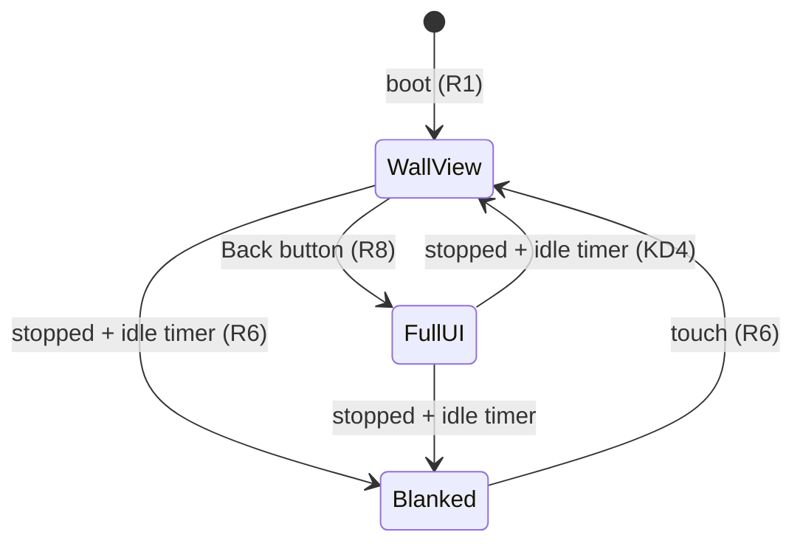
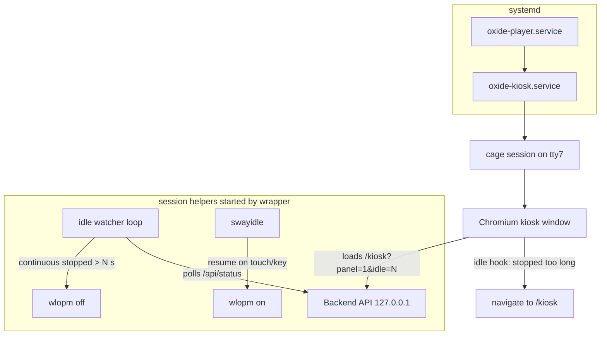

# HDMI Kiosk Display - Plan

## Goal Capsule

- **Objective:** The HDMI touchscreen attached to the oxide-player server shows the player's wall view from power-on to idle — no login terminal, no desktop environment — with touch input for walk-up control and the phone still working in parallel.
- **Means:** A single-app Wayland kiosk session (`cage` + Chromium) launched by systemd, pointed at the locally served `/kiosk` page (KTD1, KTD2).
- **Product authority:** Owner-operator (single user, sole operator of the server).
- **Open blockers:** None.

---

## Product Contract

Product Contract unchanged from the requirements-only state (no restructure, no scope change).

### Summary

The server boots straight into its existing `/kiosk` view on the attached HDMI panel, rendered by Chromium under a minimal Wayland kiosk compositor. The touchscreen provides walk-up control, the Back control opens the full UI on-panel, and the idle policy keeps the wall view alive while music plays or is paused, blanking only when stopped.

### Problem Frame

The server is a headless Ubuntu Server box with an HDMI touchscreen in the listening room. Today that panel shows a login TTY: the machine has no graphical session, so the product's own web UI — including a purpose-built full-screen kiosk page — never appears on the display it was designed for. The gap is purely system-level: something must put a browser on the panel unattended at boot, keep it running, and manage screen blanking. The repo currently contains no display-stack configuration anywhere; `install.sh` already advertises the `/kiosk` URL but nothing renders it locally.

### Actors

- A1. Walk-up listener — touches the panel to control playback, browse, or return to the wall view.
- A2. Remote controller — uses the same UI from a phone or laptop elsewhere; must be unaffected by panel state.

### Requirements

**Boot & session**

- R1. Power-on reaches the wall view unattended — no login prompt and no manual start step.
- R2. If the browser or kiosk session exits or crashes, it is restarted automatically back into the wall view.
- R3. During normal operation the HDMI console offers no interactive login terminal.

**Display & input**

- R4. Touch input works across the whole stack: kiosk controls (play/pause, skip, volume, seek, visualizer tuning) and full-UI navigation.
- R5. While playback is active — playing or paused — the display stays lit showing live content.
- R6. When playback is stopped and the idle timeout elapses, the screen blanks; a touch wakes it.

**Content**

- R7. The wall view is the existing `/kiosk` page served by the local backend; this round adds no new frontend surface.
- R8. The full UI stays reachable on-panel via the existing Back control; when the idle timeout fires while the panel is in the full UI, it auto-returns to the wall view, so waking always lands there.
- R9. Remote clients hold their own live connections concurrently with the panel; panel state never disrupts them.

**Delivery & resilience**

- R10. Setup and removal ship through the installer's existing lifecycle (install/update/uninstall paths), idempotent, following the installer's setup-function conventions.
- R11. Absence of an attached display — or any failure of the kiosk session — must not affect playback, the backend, or other installer functions.

### Key Decisions

- KD1. Single-app Wayland kiosk (`cage` + Chromium) over minimal X11 or a desktop environment. `(session-settled: user-directed — chosen over X11 recipe and desktop-environment autologin: least machinery between power-on and cover art)` Governs R1, R2, R3.
- KD2. Reuse the existing `/kiosk` page as-is; no new visual frontend surface this round. `(session-settled: user-approved)` Governs R7.
- KD3. Paused counts as active for screen timeout — only stopped playback idles toward blanking. `(session-settled: user-directed — chosen over paused-equals-idle and a separate long paused timeout)` Governs R5, R6.
- KD4. Auto-return to the wall view when the idle timer fires, even from the full UI. `(session-settled: user-directed — chosen over stay-where-you-left-it)` Governs R8.

Display lifecycle:

Playing or paused holds the current view lit indefinitely (R5).

### Key Flows

- F1. Power-on to wall view
  - **Trigger:** Machine boots (or reboots after power loss).
  - **Steps:** System services start → backend serves UI on localhost → kiosk session launches compositor + browser into the wall view → live status arrives over WebSocket.
  - **Outcome:** Panel shows cover art / track info / visualizer with no human action.
  - **Covers:** R1, R2, R7, R9.
- F2. Idle blank and wake
  - **Trigger:** Playback stops and stays stopped past the idle timeout.
  - **Steps:** Timer elapses → panel auto-returns to the wall view if elsewhere → screen blanks.
  - **Covers:** R5, R6, R8.
- F3. Walk-up control
  - **Trigger:** Listener approaches the panel during playback.
  - **Steps:** Tap kiosk controls for transport changes, or tap Back to enter the full UI and navigate normally.
  - **Outcome:** Control from the panel; leaving it alone while playback is stopped eventually returns it to the wall view per F2 (paused holds the current view, per KD3/R5).
  - **Covers:** R4, R8.

### Acceptance Examples

- AE1. **Given** playback is paused for several hours, **when** the idle timeout passes, **then** the screen stays lit (KD3).
- AE2. **Given** playback is stopped and the timeout elapses, **when** the listener touches the panel, **then** it wakes directly on the wall view even if the last screen was the library UI.
- AE3. **Given** the browser crashes mid-playback, **when** the supervisor restarts it, **then** the panel returns to the wall view and a concurrent phone client experiences no disruption.
- AE4. **Given** no display is attached, **when** the installer runs or the backend starts, **then** installation and playback behave exactly as without this feature.

### Scope Boundaries

Deferred for later:

- New wall-display features beyond the current kiosk page (clock faces, ambient modes, screensaver content).
- Viewing or controlling the panel remotely (VNC-style mirroring).
- Multiple or non-HDMI displays.

Outside this product's identity:

- General-purpose desktop use of the server console — the panel exists to show Oxide.

### Dependencies / Assumptions

- Assumes the HDMI panel accepts touch input as a standard USB HID device (no vendor driver).
- Depends on Ubuntu's packaged Chromium (or equivalent browser) being installable on the target server.
- The backend listens on the address install.sh bakes into config.json (`LISTEN`, default `0.0.0.0:80`); the kiosk session targets `http://127.0.0.1__PORT_SUFFIX__/…`, deriving the suffix from LISTEN exactly like the MOTD helper does.

---

## Planning Contract

- KTD1. Kiosk session as one systemd system unit on a logind seat: `User=oxide`, `PAMName=login`, `TTYPath=/dev/tty7`, `StandardInput=tty`, `After=systemd-logind.service dbus.socket oxide-player.service`, `Wants=oxide-player.service`, `Restart=always`, `RestartSec=3`, `WantedBy=multi-user.target`. The PAM session provides DRM/input device access and `XDG_RUNTIME_DIR`; there is no autologin and no display manager, so no login prompt can appear on the console. Chosen over getty-autologin scripts and DM-based autologin: single unit, restart semantics for free. `(instantiates KD1, session-settled: user-directed — cage+Chromium chosen over minimal X11 and desktop environment)` Governs R1, R2, R3.
- KTD2. Browser is Ubuntu's packaged Chromium (apt `chromium-browser`, snap-backed), launched native-Wayland via Ozone (`--ozone-platform=wayland --enable-features=UseOzonePlatform`) with kiosk flags (`--kiosk --noerrdialogs --disable-infobars --disable-session-crashed-bubble --hide-crash-restore-bubble`). If the Wayland backend fails at runtime, fall back to cage's optional XWayland rather than debugging Chromium Wayland issues on the target. Governs R1, R4, R7.
- KTD3. Blanking brain is a playback-aware watcher script running inside the kiosk session, not a backend feature: it polls `GET /api/status` every ~15 s, treats any non-`stopped` state as activity (KD3), and calls `wlopm --off '*'` after `idle_seconds` of continuous stopped time. `swayidle` runs purely as an activity source — its `resume` hook calls `wlopm --on '*'` so touch/key input wakes the screen regardless of watcher state. Chosen over a static swayidle timeout (blind to playback state) and over backend-driven DPMS (backend has no access to the session's Wayland socket). Governs R5, R6. `(instantiates KD3, session-settled: user-directed — only stopped blanks)`
- KTD4. Panel identity comes from the launch URL: the session opens `http://127.0.0.1__PORT_SUFFIX__/kiosk?panel=1&idle=<seconds>`; the app persists the flag and idle value in `sessionStorage` once at startup, and an idle-return hook arms only in panel mode. It navigates to `/kiosk` when playback has been continuously `stopped` past the same idle threshold and the path is not already `/kiosk`. Phones and other clients never arm the hook, so remote browsers are never auto-navigated (A2 / R9). Governs R8. `(instantiates KD4, session-settled: user-directed — auto-return chosen over stay-put)`
- KTD5. Idle timeout delivery is an installer template variable (`__KIOSK_IDLE_SECONDS__`, substituted like the existing `__PORT_SUFFIX__` pattern) baked into both the watcher invocation and the launch URL, default 600. Not a backend config key this round — one source of truth, zero backend surface. Governs R6, R10.
- KTD6. Output-power tool is `wlopm` (tiny, packaged for Debian/Ubuntu); if unavailable on the target release, the installer fails loudly at package-install time rather than silently degrading blanking. Wake reliability of DPMS resume is smoke-tested during deployment; known upstream wake quirks exist on other compositors, mitigated here by the single-output setup. Governs R6.

### Assumptions

- Touch panel enumerates as a standard USB HID device; libinput handles it without vendor drivers.
- The snap-packaged Chromium works under cage with the wayland plug; XWayland is the documented fallback (per KTD2) if not.
- Getty may remain enabled on tty1; the visible HDMI console is claimed by the cage DRM session, satisfying R3 in practice. Ctrl+Alt+F1 remains reachable by physical keyboard — accepted.
- The watcher's status parse uses minimal text matching on the JSON body (no jq dependency), consistent with installer dependency-free conventions.

### High-Level Technical Design

One wrapper script starts cage in the background, waits for its Wayland socket to appear, then starts `swayidle` and the watcher with `WAYLAND_DISPLAY` exported (helpers spawned before cage cannot reach its socket), and finally `wait`s on the cage process. Backend code is untouched; the frontend gains only the panel-mode hook (U1).

---

## Implementation Units

### U1. Panel-mode idle auto-return in the frontend

- **Goal:** In panel sessions only, navigate back to `/kiosk` after continuous stopped playback exceeds the idle threshold (R8, per KTD4).
- **Requirements:** R8; honors R7 (no new visual surface — logic only), R9 (non-panel clients unaffected).
- **Dependencies:** None.
- **Files:** `frontend/src/App.tsx` (wire hook next to existing kiosk branch), new `frontend/src/components/usePanelIdleReturn.ts`, new test `frontend/src/__tests__/panelIdleReturn.test.tsx`.
- **Approach:**
  1. On mount, read `?panel=` and `?idle=` from the launch URL once; persist into `sessionStorage`; strip nothing from the URL.
  2. Hook tracks continuous `state === "stopped"` duration from the already-subscribed player status (WS-driven, same source as `usePlayerStatus`).
  3. Past the threshold, if `window.location.pathname !== "/kiosk"`, assign `window.location.pathname = "/kiosk"`.
  4. Any transition out of `stopped` resets the accumulator.
- **Patterns to follow:** `App.tsx` pathname handling (`const [kiosk] = useState(() => window.location.pathname === "/kiosk")`); DevicesView's `setInterval` polling precedent; vitest suites mock the api module when needed.
- **Test scenarios:**
  - Panel flag set + status `stopped` continuously past threshold → navigation to `/kiosk` occurs.
  - Panel flag set + status `paused` past threshold → no navigation (Covers AE1).
  - No panel flag → hook never navigates regardless of status duration.
  - Already on `/kiosk` → no navigation (no reload loop).
  - Status leaves `stopped` before threshold → accumulator resets, later re-stop re-arms cleanly.
- **Verification:** `cd frontend && npm run build && npm test` green; manual check that a normal browser session at `/library` never navigates itself.

### U2. Playback-aware blank watcher script

- **Goal:** Blank the panel output after continuous stopped playback past the idle timeout; leave it powered otherwise (R5, R6, per KTD3/KTD5/KTD6).
- **Requirements:** R5, R6; R11 (watcher failure must not affect anything else).
- **Files:** embedded in `install.sh` inside the new `write_kiosk()` function (heredoc template, `__PORT_SUFFIX__`/`__KIOSK_IDLE_SECONDS__` substitution), installed as `/usr/local/bin/oxide-kiosk-idle-watcher`.
- **Approach:** Loop: curl `http://127.0.0.1__PORT_SUFFIX__/api/status` (short timeout, failure-tolerant), match `"state"` value; accumulate continuous `stopped` seconds; call `wlopm --off '*'` at threshold; reset accumulation and call `wlopm --on '*'` whenever state leaves `stopped`. No jq; plain POSIX sh + sed/grep text matching per Assumptions.
- **Test expectation:** none — runtime shell script verified by live smoke (see Verification Contract); structural check via `sh -n`.
- **Verification:** `sh -n` clean; live smoke checklist: playing holds power on, stopped past N blanks, touch wakes.

### U3. Kiosk session unit and launcher

- **Goal:** Boot-driven, crash-restarting graphical session that lands Chromium in the wall view (R1–R4, R7, per KTD1/KTD2).
- **Requirements:** R1, R2, R3, R4, R7, R11.
- **Dependencies:** U1 (frontend flag consumed by launch URL), U2 (watcher binary present).
- **Files:** `contrib/systemd/oxide-kiosk.service`, `install.sh` (`write_kiosk()` writes unit + wrapper script `/usr/local/bin/oxide-kiosk-session`, installs packages `cage swayidle wlopm chromium-browser`).
- **Approach:**
  1. Unit shape per KTD1; mirror comment style and capability notes from `contrib/systemd/oxide-player.service`.
  2. Wrapper sequence (order is load-bearing): start `cage -d -s -- chromium-browser <flags> "http://127.0.0.1__PORT_SUFFIX__/kiosk?panel=1&idle=__KIOSK_IDLE_SECONDS__"` in the background; poll `$XDG_RUNTIME_DIR` for a `wayland-*` socket; export `WAYLAND_DISPLAY`; then start `swayidle -w timeout 30 'true' resume 'wlopm --on "*"'` (short dummy timeout so idle state engages before the watcher can blank — resume only fires once idle has been entered) and the U2 watcher in background; finish with `wait` on the cage PID.
  3. Installer enables `oxide-kiosk.service`; ordering keeps backend first so the first paint has data.
  4. Package availability checked by apt itself — missing `wlopm` fails the install loudly (KTD6).
- **Test expectation:** none — system-level scaffolding verified by smoke; structural checks: `bash -n install.sh`, `systemd-analyze verify contrib/systemd/oxide-kiosk.service`.
- **Verification:** Unit verifies clean; live smoke: reboot lands in wall view, `pkill chromium` recovers within RestartSec, getty prompt not visible on HDMI.

### U4. Installer lifecycle integration and docs

- **Goal:** Kiosk feature follows install/update/uninstall lifecycle idempotently and is discoverable (R10, R11).
- **Requirements:** R10, R11.
- **Dependencies:** U2, U3.
- **Files:** `install.sh` (`do_uninstall` removes unit + disables service + drops installed scripts; update path re-runs `write_kiosk()` harmlessly), `README.md` (short "Wall display (kiosk)" section: what it is, how to disable).
- **Approach:**
  1. Uninstall mirrors the MOTD removal pattern: stop/disable unit, remove unit file and scripts, leave packages installed (harmless, reversible).
  2. Update path: rewrite unit/script templates, `systemctl daemon-reload`, keep service enabled state.
  3. Post-install summary already prints the kiosk URL (`install.sh:1187`) — unchanged.
- **Patterns to follow:** `write_motd()` lifecycle wiring (install/update/uninstall paths); placeholder substitution `_motd="${_motd//__PORT_SUFFIX__/$_port_suffix}"`.
- **Test scenarios:**
  - Fresh install path creates unit, enables it, writes scripts with substituted values.
  - Second install run is idempotent (no duplicate units/scripts, service stays enabled).
  - Uninstall removes unit + scripts, disables service, leaves backend untouched.
- **Verification:** Run install.sh in a container or dry-run harness if available; else structural review plus live-server smoke during deployment.

---

## Verification Contract

- Frontend type gate + unit tests: `cd frontend && npm run build && cd .. && npm --prefix frontend test` — must pass before push to `main` (repo bug rule).
- Backend suite untouched by this plan (no backend changes): `cargo test` expected green without frontend-dist-dependent regressions — build frontend first per CI order.
- Structural checks for system-level artifacts: `bash -n install.sh`, `sh -n` on extracted watcher template, `systemd-analyze verify contrib/systemd/oxide-kiosk.service`.
- Live smoke checklist (target server, during deploy): boot lands in wall view unattended; touch controls respond; Back reaches full UI; stopped past idle blanks; touch wakes onto wall view within seconds of blanking; paused holds screen awake; `pkill chromium` self-heals; phone client unaffected throughout.
- Browser-test scope for CI-side changes: the frontend auto-return behavior (U1) via vitest; no Playwright/browser-suite exists in-repo beyond `tests/ui-smoke.sh`, which needs a populated library and is not part of this plan's gate.

## Definition of Done

Global:

- All four units landed; frontend tests green; structural checks pass; README documents the feature.
- No backend source changes remain in the diff (plan promises none).
- Abandoned-attempt code (alternative watcher implementations, debug units) removed, not left in the diff.

Per-unit:

- U1: test scenarios enumerated above exist in `frontend/src/__tests__/panelIdleReturn.test.tsx` and pass.
- U2/U3/U4: verification lines above hold; uninstall path proven non-destructive to backend service.
